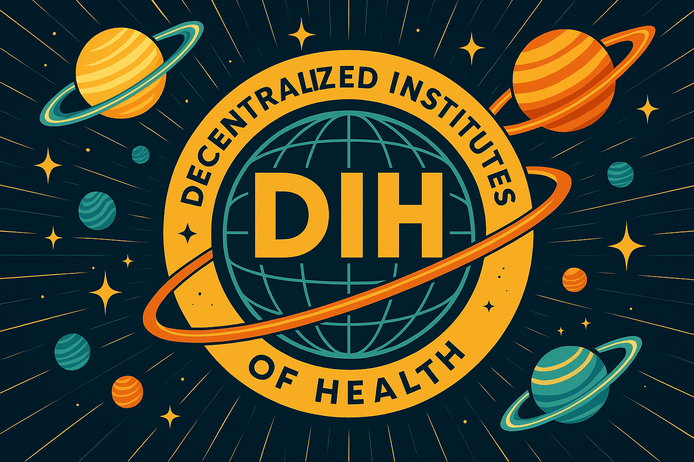



## The Objective: Total Disease Eradication

The goal is simple: **eliminate all disease**.

The constraint is also simple: **resources are scarce**.

This creates an optimization problem. With limited money, time, and talent, how do you maximize progress toward eradication? Every dollar spent on a low-impact trial is a dollar not spent on a high-impact one. Every researcher writing grant applications is a researcher not curing cancer. Every patient excluded from trials is data we don't collect.

The current system fails this optimization spectacularly.

The NIH spends  a year. Scientists spend 50-67% of their time writing grant applications [@grant-writing-time-50pct] instead of doing research. Billions flow to projects that never produce treatments. The system isn't designed to maximize cures. It's designed to maximize grant-writing.

This isn't a conspiracy. It's just what happens when you design a system that rewards asking for money instead of producing results.

### Why Current Systems Fail

| Problem | Cause | Result |
|:--------|:------|:-------|
| **Misaligned incentives** | Researchers paid for proposals, not cures | 50-67% of time on paperwork |
| **Coordination failure** | No mechanism to connect patients, researchers, funders | 240x more willing participants than slots |
| **Regulatory capture** | Concentrated interests influence allocation | Resources flow to lobbies, not impact |
| **Information silos** | Negative results hidden | Same failures repeated globally |

A decentralized institute of health (DIH) is an alternative design that optimizes for a single metric: **maximum ROI toward disease eradication**.

## The Health-Industrial Complex: Coordinating the War on Disease

### The Olsonian Problem

Economist Mancur Olson identified why public goods are systematically underproduced: **diffuse benefits and concentrated costs**.

Curing cancer benefits 8 billion people a little. Blocking cancer cures benefits a few thousand pharmaceutical executives a lot. The executives show up to lobby. The 8 billion don't. This is why we've spent 50 years "fighting cancer" while the defense industry got stealth bombers, aircraft carriers, and GPS.

The military-industrial complex solved this problem for defense. Defense contractors, generals, politicians, and workers all have concentrated interests in military spending. They coordinate. They lobby. They win budgets. The result: the most powerful military in human history.

Disease has no such coalition. Patients are diffuse. Researchers compete for scraps. Funders lack coordination. Politicians get no credit for cures that arrive after their term. Everyone wants disease eradicated; no one has a concentrated interest in making it happen.

**DIH solves the Olsonian problem by creating concentrated interests in disease eradication.** See [The Incentive Stack](#the-incentive-stack-making-roi-the-selfish-choice) for how DIH aligns every actor's self-interest with maximum-impact work.

The military-industrial complex coordinates actors around defense. DIH creates a **health-industrial complex** that coordinates actors around eradication.

### SHAEF for the War on Disease

In 1944, the Allied forces faced a coordination problem. The Americans, British, Canadians, Free French, and others each had their own armies, their own generals, their own supply chains, and their own objectives. Without coordination, they would have fought separate wars and lost.

The solution was SHAEF: Supreme Headquarters Allied Expeditionary Force. Eisenhower didn't replace the individual armies. He coordinated them. SHAEF set the overall objective (defeat Nazi Germany), allocated resources across theaters, resolved conflicts between commands, and ensured every division's actions contributed to the unified goal.

**DIH is SHAEF for the war on disease.**

| WW2 Allied Forces | War on Disease |
|:------------------|:---------------|
| SHAEF (coordination layer) | DIH (coordination protocol) |
| Individual armies (US, UK, etc.) | Research institutions, pharma, patient groups |
| Theaters of operation | Disease areas (cancer, aging, infectious disease) |
| D-Day (unified objective) | Total disease eradication |
| Resource allocation across fronts | Patient subsidies (market mechanism) + infrastructure governance |
| Intelligence sharing | Open data commons, mandatory publication |
| Combined Chiefs of Staff | Algorithmic governance, no single commander to corrupt |

The individual armies didn't disappear. The British Army remained British. The US Army remained American. But they fought as one force because SHAEF coordinated their actions toward a shared objective.

Similarly, DIH doesn't replace existing institutions. Pharma companies remain pharma companies. Universities remain universities. Patient advocacy groups remain advocates. But they operate as one force because DIH coordinates their actions toward eradication.

### Why This Framing Matters

The war on disease has been losing for 50 years because it's not actually a war. It's a collection of uncoordinated skirmishes.

- Researchers compete for grants instead of collaborating on cures
- Pharma companies duplicate efforts and hide failures
- Patients can't access trials; their data goes uncollected
- Politicians fund what lobbyists want, not what works
- Funders spray money without measuring impact

Imagine if D-Day had been run this way. The Americans land at one beach, the British at another, neither tells the other what they learned, and both compete for the same supply ships while German intelligence reads their grant applications.

That's the current war on disease. DIH is the coordination layer that turns scattered skirmishes into a unified campaign.

## DIH: The ROI Maximization Protocol

A DIH is not a platform. It's not an organization. It's a **coordination protocol** with one function:

> **Ensure every actor does the highest-ROI thing toward total disease eradication.**

This means:

- Every dollar flows to maximum impact
- Every researcher works on highest-value problems
- Every patient joins trials that matter most
- Scarce resources are never wasted on low-ROI activities

### Three Core Functions

A DIH does exactly three things:

1. **Receive funds** (from the [1% Treaty](1-percent-treaty.qmd), donations, etc.)
2. **Allocate research via patient subsidies** (market mechanism) and **infrastructure via [Wishocracy](wishocracy.qmd)**
3. **Verify results and pay proportional to impact**

Everything operational is outsourced. Trial infrastructure? That's [dFDA's](dfda.qmd) job. Task decomposition? AI services. Talent matching? Existing marketplaces. Crowdfunding? Existing platforms.

Why stay thin? Because **thin protocols are hard to capture**. There's nothing to bribe. No operational role to corrupt. No CEO to influence. Just code that moves money toward measured outcomes.

::: {.callout-note icon=false}
## The Core Innovation: Pay for Results

Every dollar flows based on results, not promises:

- **Patients vote with their enrollment** -> Researchers get paid for attracting patients
- **Outcomes determine continued funding** -> Campaigns that deliver get more; failures get defunded
- **No one gets paid for:**
  - Writing grant proposals
  - Attending review committees
  - Publishing papers about why their research might work someday

This is how most other industries work. You pay contractors when they build the house, not when they promise to build it. You pay farmers when they grow the food, not when they apply for a farming license.
:::

### The Data Commons: Publish Everything

The current system hides failures. Companies bury negative results. Researchers don't publish what didn't work. Scientists waste billions repeating mistakes someone else already made.

DIH requires **100% open publication** of all data, positive and negative, as a condition of funding:

- Every trial, every result, every dataset published
- AI models scan the global data commons, finding patterns humans miss
- Failed experiments become shared knowledge, not repeated waste

This is intelligence sharing in the SHAEF analogy. The Allies won partly because they shared Ultra intercepts across commands. The war on disease loses because everyone guards their failures like trade secrets. A group chat where everyone shares what didn't work, except the group is humanity and the topic is death prevention.

## Governance: Market Mechanism + Wishocracy

DIH uses two allocation mechanisms:

- **Patient subsidies (market mechanism):** Research funding follows patient choice. Patients enroll in trials they believe in; funding flows accordingly. Variable subsidy rates ensure rare diseases remain viable. No committees decide "cancer vs Alzheimer's."

- **[Wishocracy](wishocracy.qmd):** For infrastructure and public goods only. Aggregates preferences through pairwise comparisons ("EHR integration or security audits?"). See the [dedicated page](wishocracy.qmd) for details.

## The Incentive Stack: Making ROI the Selfish Choice

DIH doesn't rely on altruism. It **pays everyone to do the highest-ROI thing**.

| Actor | Self-Interest | DIH Incentive | ROI Alignment |
|:------|:--------------|:--------------|:--------------|
| **Researchers** | Money, prestige | Per-patient subsidies (higher for rare diseases) | Attract patients = get paid |
| **Patients** | Health, compensation | Subsidies scale with trial importance | Joining high-priority trials = more paid |
| **Politicians** | Re-election, legacy | [IABs](incentive-alignment-bonds.qmd) tied to disease outcomes | Better outcomes = bigger bonus |
| **Funders** | Impact, returns | Quadratic matching, outcome tracking | High-ROI donations = amplified impact |
| **Data providers** | Revenue | Fees tied to data utility | More useful data = more revenue |
| **Campaigns** | Funding | Results-based continued funding | Higher ROI = more funding |

Every incentive is ROI-weighted. Not just "do good" but "do the MOST good per dollar/hour." DIH makes the highest-ROI action the selfish choice for every actor.

### How Researchers Get Paid

Traditional system: Write a grant proposal. Hope a committee likes it. Get paid to try.

DIH system:

1. **Per-patient subsidies:** The more patients who believe in your trial enough to join, the more funding you get. Subsidies are paid per enrolled patient.
2. **Variable subsidy rates:** Rare diseases and high-unmet-need conditions receive higher per-patient subsidies, making them economically viable despite smaller patient pools.
3. **Results-based continuation:** Deliver results, get more funding. Don't deliver, get defunded.

**Single-sentence summary:** Pay scientists like you pay plumbers: for fixing the problem, not for explaining why it's hard.

### How Politicians Get Aligned

Politicians optimize for reelection, status, and post-office careers. Not "humans continuing to exist."

[Incentive Alignment Bonds](incentive-alignment-bonds.qmd) solve this by making "support pragmatic clinical trial funding" the career-optimal move:

- **Public Good Scores** track voting records on health policy
- **Electoral support** flows to high-scorers via independent PACs
- **Post-office opportunities** (fellowships, boards) reserved for leaders who governed well

No bribes. No corruption. Just a standing rule: if you support policies that measurably reduce suffering, your political life gets easier.

## How the Money Flows



### The Architecture

**The [1% Treaty Fund](1-percent-treaty.qmd):**

- Holds the treasury (from the [1% Treaty](1-percent-treaty.qmd))
- Allocates between infrastructure and public goods via [Wishocracy](wishocracy.qmd)
- Funds campaigns, not bureaucracies
- No CEO, no board, no one to corrupt

**Your Decentralized Institute of Health (DIH):**

- A thin coordination protocol
- Receives funding *from* the 1% Treaty Fund
- Research allocation via patient subsidies (market mechanism)
- Verifies results, pays for outcomes

**The [Decentralized Framework for Drug Assessment (dFDA)](dfda.qmd):**

- A funded **campaign**, not part of DIH itself
- Provides technical infrastructure for trials
- Competes with other research models for funding
- Has no budget authority (just a service provider)

### The Fund Flow

A [1% Treaty](1-percent-treaty.qmd) redirects **** a year from global military budgets into the 1% Treaty Fund. But not all of it reaches research:

| Allocation | Share | Amount | Purpose |
|:-----------|:------|:-------|:--------|
| [VICTORY Bond investors](../economics/victory-bonds.qmd) |  |  | Repay campaign funders |
| [Political incentives (IABs)](incentive-alignment-bonds.qmd) |  |  | Keep politicians aligned |
| **Research treasury** |  | **** | Patient subsidies (market allocation) |

### What Gets Funded: Market Failures Only

Since most research allocation is handled automatically (patients choose trials → funding flows there), the 1% Treaty Fund primarily funds **market failures**, things the ecosystem can't handle:

**Infrastructure**

- Development and operations
- Competing alternative implementations
- Data commons infrastructure (storage, processing)
- Security audits and fraud detection systems

**True Public Goods (No Revenue Model)**

- Patient trial participation subsidies
- Negative results publishing
- Replication studies

This is minimal by design. The ecosystem eliminates most traditional research funding needs. Companies register treatments → Patients join trials → Revenue flows → Research happens. DIH only directs the 1% Treaty Fund to cover what the ecosystem truly can't handle.

## What DIH Outsources (and Why)

DIH is intentionally minimal. It outsources everything operational:

| Function | Outsourced To | Why |
|:---------|:--------------|:----|
| **Crowdfunding** | Gitcoin, Juicebox, etc. | They already exist and work |
| **Task decomposition** | AI services | Machines are better at this |
| **Talent matching** | Existing marketplaces | Don't reinvent LinkedIn |
| **Trial infrastructure** | dFDA (a funded campaign) | Separate concerns |
| **Data storage** | Competing providers | Market competition |

## How Campaigns Plug In

dFDA is the primary example of a funded campaign. It's not part of DIH; it's a service provider competing for funding.

### Campaign Lifecycle

1. **Proposal:** Submit campaign description, budget, milestones
2. **Wishocracy vote:** Humanity decides priority relative to alternatives
3. **Funding:** Treasury allocates based on vote + Optimocracy recommendations
4. **Execution:** Campaign delivers services (trials, infrastructure, etc.)
5. **Verification:** Outcomes measured against milestones
6. **Continuation:** Results determine next year's funding

## Anti-Capture Design

The current system is trivially captured. Concentrate billions of dollars in a few committees, and lobbyists will find them.

DIH is designed to make capture economically irrational.



### How DIH Resists Capture

| Mechanism | How It Works | Capture Cost |
|:----------|:-------------|:-------------|
| **No CEO** | Nothing to bribe | N/A |
| **Algorithmic governance** | Rules in smart contracts | Can't bribe an if-statement |
| **Public ledger** | Every dollar tracked | Corruption is visible |
| **Forkable** | Anyone can clone the protocol | Capture triggers replacement |
| **Distributed voting** | Millions vote via Wishocracy | Lobbying doesn't scale |
| **Outcome-based funding** | Results determine allocation | Gaming harder than performing |

### The "New FDA" Risk

**Risk:** "What if dFDA becomes the new FDA, capturing regulatory power?"

**Mitigation:** dFDA has no budget authority. It's just a campaign competing for funding from the 1% Treaty Fund. If it gets captured, fund a competing framework instead.

The protocol is designed so that **no single component can monopolize power**. Everything is replaceable. Nothing is essential except the coordination rules themselves.

### Security Architecture: Multi-Layered Defense

A  treasury is a massive target. DIH uses defense in depth:

**1. Nobody's in Charge (And That's the Point)**

*Turns out you don't need a CEO when you have math.*

- Every VICTORY Bond holder directly controls treasury through on-chain voting
- No human signers = no kidnapping, corruption, or coercion targets
- Smart contracts automatically execute community decisions after 24-72h timelocks
- Battle-tested approach already managing billions in MakerDAO, Uniswap, Aave

**2. AI-Powered Fraud Detection**

- **Fraud Agent:** Real-time anomaly detection, duplication monitoring, collusion identification, sybil detection
- **Safety Oracle:** Incident severity scoring with automatic payout holds for affected interventions
- **Identity Oracle:** Verifies affiliations and conflicts, prevents unauthorized access
- Manual review queue for flagged actions with whistleblower bounty rewards

**3. Complete Transparency & Auditability**

- All treasury addresses published with real-time public dashboards
- Immutable transaction logs with standardized disbursement tags
- Annual smart contract audits and semiannual operational audits with published reports
- Hash-committed invoices and budgets for full accountability

**4. Recovery & Response Mechanisms**

- Clawbacks for data falsification or trial misconduct
- Emergency pause capabilities triggered by incident signals
- Progressive unpause policies tied to remediation completion
- Guardian modules for pausing non-critical functions under defined conditions

### Beyond Medical Research

Once you prove you can run a  treasury without anyone stealing from it, you can do the same for schools, roads, or anything else the government currently screws up:

- **Education:** Pay teachers based on whether kids actually learn things
- **Infrastructure:** Fund roads that don't immediately fall apart
- **Environment:** Pay for actual carbon reduction, not paperwork
- **Social Services:** Get help to people who need it without 47 forms

This isn't just about protecting health funding. It's an experiment in demonstrating a new model for uncorruptible, transparent governance of public goods. The 1% Treaty Fund becomes the prototype for a new era of public governance, one that eliminates human corruption points entirely while delivering measurable results.

## Summary: The Coordination Layer

DIH is not trying to be a research institution, a trial platform, or a funding agency. It's trying to be **the thin layer that coordinates all of them**.

| Component | Function | DIH's Role |
|:----------|:---------|:-----------|
| 1% Treaty Fund | Treasury | Receives funds from treaty |
| Patient subsidies | Research allocation | Market mechanism (patients choose trials) |
| Wishocracy | Infrastructure governance | Allocates between infrastructure/public goods |
| dFDA | Trial infrastructure | Funded campaign |
| IABs | Political alignment | Keeps politicians incentivized |
| VICTORY Bonds | Investor alignment | Funds the campaign |

**The single sentence version:**

> DIH is a coordination protocol that receives funds, allocates research funding via patient subsidies (market mechanism), governs infrastructure via Wishocracy, verifies results, and pays proportional to outcomes, making the highest-ROI action the selfish choice for every actor.

That's the theory. The rest of this guide explains how you'd actually build it.
