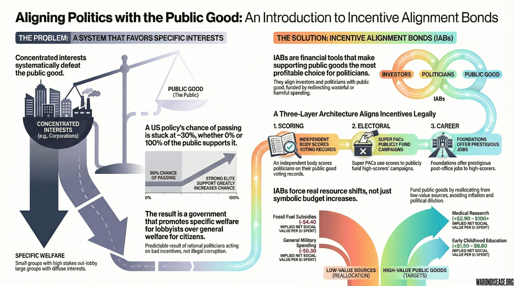



> **Related:** [Aligning Incentives](aligning-incentives.qmd)  | [Investor Materials](../economics/victory-bonds.qmd) | [Academic Paper](../appendix/incentive-alignment-bonds-paper.qmd)

::: {.callout-note}
## A Novel Approach to Political Economy

Incentive Alignment Bonds represent a new class of financial instrument, distinct from Social Impact Bonds, lobbying, or campaign finance, designed to systematically align politicians' career incentives with measurable public goods. The three-layer architecture described here (scoring, electoral support, post-office benefits) provides a legal template that could apply to any global coordination problem: climate change, nuclear disarmament, pandemic preparedness, and beyond.
:::

{#fig-iab-infographic}

Here's a fun puzzle: You know how to save millions of lives. You can measure exactly how many. You have the money. And governments still don't do it.

This isn't because politicians are evil. It's because the system is built so that:

* Politicians maximize **reelection, status, and post-office careers**, not "humans continuing to exist"
* Bureaucracies maximize **budget, stability, and turf**, not "speed of cures"
* Lobbyists maximize **client profits**, not "global welfare"

You don't fix this with awareness campaigns. You've been "raising awareness" for decades and everyone is still dying. You don't fix it with white papers. Politicians use white papers to stabilize wobbly tables. You don't fix it by hoping for philosopher-kings. Plato tried that. It didn't work.

You fix it by changing **what "self-interest" points at**.

This chapter describes a mechanism to legally bribe politicians into doing the right thing:

> **Incentive Alignment Bonds (IABs)** – a way to pay for better governance without technically paying politicians, giving money to governments, or going to prison.

### The Core Problem: Good Ideas Die in Committee

You've seen the numbers by now:

* Redirecting **1% of global military spending** into pragmatic trials could save hundreds of millions of lives and generate trillions in economic value.

The 1% Treaty isn't constrained by physics, biology, or money. It's constrained by **politics**, which is like being constrained by your dog's opinion on quantum mechanics except your dog can veto legislation.

No politician wants to be the one who "cut the military." Even by 1%. Even if that 1% cures cancer. The attack ads write themselves: "Senator Johnson voted to WEAKEN AMERICA. His opponent didn't. Vote for literally anyone else."

From a public choice perspective, the 1% Treaty is a classic public good:

* Enormous global benefit
* Concentrated local political pain
* Benefits arrive in 10 years; the attack ads arrive tomorrow

The system does exactly what it's incentivized to do. It's not broken. It's working perfectly. The problem is what it's optimizing for.

If you want different outcomes, you need different incentives. Wishing very hard doesn't count.

### What You Need: Legal Bribery That Isn't Technically Bribery

Imagine you could say to every politician on Earth:

> "If you vote for a 1%-style reform and your country actually funds it, we will:
>
> * upgrade your international reputation (you'll get invited to better parties),
> * boost your reelection odds (independent campaigns will favor you),
> * and make your post-office career prospects significantly better than your rivals' (Goldman Sachs boards, prestigious fellowships, that sort of thing)."

No backroom deals. No suitcases of cash. No prison.

No money to you personally, and no money to government budgets. What you get is external legitimacy, electoral support, and cushy retirement gigs. The things politicians actually optimize for.

Just a standing, public, announced-in-advance rule:

> "Do this objectively good thing, and the world will systematically reward you."

This is the job of **Incentive Alignment Bonds**. It's bribery, except legal, transparent, and pointed at saving lives instead of ruining them.

### Definition: What Are Incentive Alignment Bonds?

Incentive Alignment Bonds (IABs) are a new class of financial instruments designed to:

1. **Reward investors** with returns proportional to public-good funding achieved
2. **Reward politicians** with electoral support and career benefits based on their voting record for public-good policies
3. **Fund the public good itself** from the policy outcome (self-sustaining)

**The key innovation:** IABs align **both** investors and politicians with public-good outcomes through a single instrument. Investors provide capital to pass the policy. Politicians get career benefits for supporting it. The policy outcome funds everything.

This is mechanism design applied to governance, using the tools economists developed for auctions and markets to solve political economy problems. The insight is that politicians respond to incentives like everyone else; the question is whether those incentives point toward saving lives or toward pleasing lobbies. IABs change what the incentives point at.

They are not charity. (Charity doesn't work at scale.)
They are not lobbying. (That's already taken.)
They are not "paying politicians." (That's illegal, and also already taken.)

They are:

> **A way to make investors and politicians cooperate on public goods by appealing to the only thing they respond to: self-interest.**

#### How IABs Differ from Social Impact Bonds

| | Social Impact Bonds | Incentive Alignment Bonds |
|:--|:--|:--|
| **Who's rewarded** | Service providers (nonprofits) | Politicians AND investors |
| **What's measured** | Service delivery outcomes | Policy adoption and funding flows |
| **Attribution** | Easy (one provider, one program) | Based on votes and $ contributed |
| **Scale** | City/program level | National/global |
| **Funding source** | External (government pays for outcomes) | Self-funding (policy outcome funds returns) |

Think of IABs as:

* **Social impact bonds**, but rewarding politicians and investors instead of service providers.
* **Advance Market Commitments**, but aimed at policies instead of vaccines.
* **Bribery**, but legal, transparent, and aimed at reducing human suffering instead of increasing it.

### How Incentive Alignment Bonds Work – The Simple Version

Let's walk through the basic structure in four steps.

#### Step 1: Define a Measurable Outcome

You choose an outcome that:

* Is **measurable** with agreed methods.
* Is **directly attributable** to policy actions.
* Matters at scale.

**Measure funding flows, not downstream health outcomes.** Health benefits are global and diffuse - you can't attribute a cure discovered via a global framework for ubiquitous pragmatic trials to any specific country's funding. But you CAN measure:

* % of military spending redirected to the 1% Treaty Fund
* Total $ contributed by each country
* Politician votes on treaty passage/expansion

For the 1% Treaty, the measurable outcomes are:

> **$ flowing to the 1% Treaty Fund** and **% of military spending redirected** - not health outcomes, which are global and unattributable.

Health improvements are the *justification* for the policy. Funding flows are the *metric* for scoring, because they're what politicians can actually control and be held accountable for.

#### Step 2: Raise Capital

Foundations, impact investors, development banks, and perhaps even regular investors buy **Incentive Alignment Bonds**.

* The capital raised is held by an independent entity (a trust, fund, or special-purpose vehicle).
* Buyers know: “This bond pays out if and only if objectively measured public-good targets are hit.”

This is structurally similar to:

* Green bonds that pay based on environmental performance.
* Catastrophe bonds that pay based on disaster events.
* Social impact bonds that pay based on outcome metrics.

#### Step 3: Fund Outcomes, Reward Politicians Indirectly

When a politician:

1. Votes for a 1%-style policy (e.g., reallocating 1% of the military budget to pragmatic clinical trials), and
2. The policy passes and funding actually flows to the treaty fund,

the mechanism triggers **indirect rewards**:

* **Public Good Scores** rise (published by independent rating organizations)
* **Electoral support** increases (independent campaigns favor high-scorers)
* **Post-office opportunities** unlock (fellowships, advisory boards, speaking circuits)

The core principle:

> No money flows to politicians or governments. What flows is **reputation, electoral advantage, and career advancement**.

This avoids the "that's just bribery" problem entirely. Nobody's getting paid. They're just getting credit for doing their job well, in ways that happen to benefit their careers.

#### Step 4: Make Politicians Care (Without Paying Them)

The magic is that **supporting 1%-equivalent policies translates directly into political benefits**.

Because:

* Citizens who see their country funding cures credit the politicians who made it happen (this is called "democracy working correctly").
* Independent rating systems give politicians a **Public Good Score** based on:

  * whether they voted for 1%-equivalent policies, and
  * whether funding actually flowed to the treaty fund.

* Media, NGOs, and external coalitions:

  * highlight high-score politicians,
  * spend more on independent campaign support for them,
  * invite them into prestigious roles after office.

No private deals.
No “you personally get money.”
Just a **standing rule**:

> “If you support this kind of high-impact policy and it works, the world will systematically make your political life easier, your legacy better, and your post-office prospects brighter.”

That is **public choice-compatible** incentive alignment.

In mechanism design terms: the politician's utility function is roughly:

> U = P(reelection) + career advancement + post-office income + status/legacy

IABs make supporting 1%-equivalent policies **strictly increase all four terms**. No altruism required. The mechanism is *incentive-compatible*: the privately optimal action (maximize personal payoff) and the socially optimal action (support policies that reduce suffering) become identical.

### 4a. The Three-Layer Architecture (How to Not Go to Prison)

The previous section described the *what*. This section describes the *how*, in enough detail that a lawyer could implement it without anyone getting indicted.

You cannot legally say "support Bill #XYZ123 and get paid." That's bribery. People go to prison for that. It's also inefficient because you'd have to bribe every politician individually, which doesn't scale.

But you *can* create a system where politicians who support a **class of pro-social policies** systematically get more electoral support, better reputations, and better post-office careers. The trick is: rule-based, ex-ante, universal mechanisms. No targeting individuals. No secret deals. Just standing rules that happen to reward saving lives.

Here's the architecture:



#### Layer A: Outcome and Policy Scoring (Data Only)

Create an independent scoring system that assigns each politician a **Public Good Score** based on their **policy actions** (not downstream health outcomes, which are global and unattributable to any single country):

* Votes in favor of "1%-equivalent" measures
* Sponsorship of such bills
* Public commitments and campaign positions
* Blocking harmful reversals
* Actual funding flows resulting from their votes

Critical design choice: **Don't tie scores to "The 1% Treaty" specifically.** Define a policy class:

> "Policies that reallocate ≥1% of national military spending into independently governed pragmatic clinical trials with open data and outcome-based evaluation."

Any politician supporting *any* policy matching this pattern gets credit. This avoids the "paying for your specific bill" problem entirely.

The scoring system is:

* **Public** (anyone can see the methodology and data)
* **Rules-based** (no discretion, no case-by-case decisions)
* **Non-partisan** (applies equally to all parties and ideologies)

#### Layer B: Electoral and Reputational Benefits (Separate Actors)

Independent entities, legally separate from the scoring system, can commit **ex ante** to favor high-scoring politicians:

**501(c)(4) organizations and PACs can:**

* Spend more on independent ads and voter turnout for higher-scoring candidates
* Run comparative campaigns: "Senator Smith scored 23 on the Public Good Index. His opponent scored 78. One of them wants you to keep dying."

**NGOs and media can:**

* Publish annual rankings of politicians by Public Good Score
* Feature high-scorers at conferences (politicians love conferences)
* Create awards (politicians love awards even more than conferences)

The goal is to make the Public Good Score as influential as existing trusted benchmarks:

* **Freedom House** scores shape how democracies are perceived globally
* **Transparency International** rankings affect investment and diplomatic relationships  
* **Credit ratings** (Moody's, S&P) directly constrain sovereign borrowing costs

Moody's can downgrade a country's credit rating and suddenly their borrowing costs go up. That's power. If the Public Good Score achieves similar salience:

* High score → respect, invitations, soft power, legacy, better book deals
* Low score → reputational cost, fewer opportunities, awkward questions at dinner parties

That's a direct self-interest lever that requires no altruism to activate. Politicians don't need to become better people. They just need to notice which direction the incentives are pointing.

**Key constraints:**

* No private deals ("we promise *you* specifically")
* Just standing rules ("we support *any* candidate with Score ≥ S")
* All commitments made publicly and in advance

This is exactly how NRA grades, League of Conservation Voters scores, and Chamber of Commerce ratings already shape political behavior. The difference is the metric: instead of "did you vote for our narrow interest," it's "did you vote for policies that measurably reduced human suffering."

#### Layer C: Post-Office Career Benefits (The Goldman Sachs Board Problem)

After politicians leave office, they want prestigious jobs. Board seats. Fellowships. Speaking fees. This is called "the revolving door" and it's usually pointed at whoever paid the most lobbyists.

You can point it somewhere else.

Foundations, think tanks, and impact funds can establish:

> "Eligibility for certain fellowships, advisory roles, and governance positions is restricted to former leaders who:
> 1. Voted for 1%-equivalent policies during their tenure, and
> 2. Maintained a Public Good Score above threshold X."

Politicians know this rule **in advance**. Their calculation becomes:

* Support 1%-style reform → prestigious fellowships, advisory boards, speaking circuits, book deals
* Oppose it → you can still get a job, but it won't be as good, and you'll have to explain why you voted against curing diseases

No one is paid for a specific vote. There's just a standing rule that systematically advantages leaders who governed well by objective metrics. It's the revolving door, except spinning toward "saved lives" instead of "military contractor profits."

#### Legal Entity Separation

The three layers must be housed in legally distinct entities:

| Layer | Entity Type | Can Do | Cannot Do |
|:------|:------------|:-------|:----------|
| Scoring | 501(c)(3) or independent research org | Fund metrics, dashboards, public data | Support/oppose candidates |
| Electoral | 501(c)(4), PAC, or Super PAC | Independent expenditures favoring high-scorers | Coordinate with candidates |
| Post-office | Private foundations, think tanks | Set eligibility criteria for positions | Condition grants on specific votes |

This separation is not a loophole; it's how the system maintains legitimacy. Each layer does what it's legally permitted to do, and the combined effect is that supporting 1%-equivalent policies becomes the utility-maximizing choice for rational politicians.

### 4b. A Worked Example: How Senator Smith Votes Yes on the 1% Treaty

Abstract mechanisms are great for economists and terrible for everyone else. Here's how IABs actually work, using a US senator deciding how to vote on the 1% Treaty as the example.

#### The Primary Metrics We're Maximizing

The whole point of this system is to increase two numbers:

1. **% of military spending reallocated** (starts at 1%, goal is expansion to 2%, 5%, 10%+)
2. **$ flowing to 1% Treaty Fund annually** (starts at , scales with %)

Every politician's score is tied to their impact on these numbers. Vote to increase them? Score goes up. Vote to decrease them? Score goes down. It's that simple.

#### The Politician's Utility Function

Politicians optimize for a utility function whether they admit it or not. Here's what it looks like:

$$
U_{politician} = \alpha \cdot P(\text{reelection}) + \beta \cdot \text{PostOfficeIncome} + \gamma \cdot \text{Status/Legacy}
$$

Where:

- $\alpha, \beta, \gamma$ are weights (varies by politician, but all are positive)
- $P(\text{reelection})$ = probability of winning next election
- $\text{PostOfficeIncome}$ = expected lifetime earnings after leaving office (boards, speaking fees, fellowships)
- $\text{Status/Legacy}$ = how history remembers you (books written, buildings named, Wikipedia length)

The IAB system makes each of these terms a function of the politician's **Public Good Score**.

#### The Public Good Score

Each politician gets a score based on their **voting record** :

$$
\text{Score}_i = \text{VoteRecord}_i
$$

Where:

**VoteRecord** (0-100) measures how a politician voted on bills that affect funding flows:

| Bill Type | Yes Vote | No Vote |
|:----------|:---------|:--------|
| Increase % reallocation to the 1% Treaty Fund | +15 points | -15 points |
| Protect existing 1% Treaty Fund funding | +10 points | -10 points |
| Expand treaty to more countries | +10 points | -10 points |
| Cut 1% Treaty Fund funding or % | -20 points | +5 points |
| Procedural support (cloture, etc.) | +5 points | -5 points |

#### How Score Translates to Utility

Here's where self-interest kicks in:

**Reelection Probability:**

$$
P(\text{reelection}) = P_0 + \delta \cdot (\text{Score}_i - 50) + \epsilon \cdot \text{IndependentSpending}_i
$$

Independent health advocacy PACs commit to spending proportional to score:

$$
\text{IndependentSpending}_i = \begin{cases} 
+\$2M & \text{if Score} \geq 70 \\
+\$500K & \text{if } 60 \leq \text{Score} < 70 \\
\$0 & \text{if } 50 \leq \text{Score} < 60 \\
-\$500K \text{ (to opponent)} & \text{if } 40 \leq \text{Score} < 50 \\
-\$2M \text{ (to opponent)} & \text{if Score} < 40
\end{cases}
$$

**Post-Office Income:**

$$
\text{PostOfficeEligibility} = \begin{cases} 
\text{Tier 1 (WHO boards, Aspen fellowships)} & \text{if Score} \geq 75 \\
\text{Tier 2 (Think tank positions)} & \text{if } 60 \leq \text{Score} < 75 \\
\text{Tier 3 (Standard revolving door)} & \text{if Score} < 60
\end{cases}
$$

Expected post-office income by tier:

| Tier | Annual Income | Prestige | Example Positions |
|:-----|:--------------|:---------|:------------------|
| Tier 1 | $500K+ | High | WHO Advisory Board, Aspen Health Fellowship, Nobel committee |
| Tier 2 | $200-400K | Medium | Brookings, RAND, university chairs |
| Tier 3 | $150-300K | Low | Defense contractor boards, lobbying firms |

#### The Setup

[VICTORY Incentive Alignment Bonds](../economics/victory-bonds.qmd) have raised  from investors who want  returns. That money has funded:

- A referendum showing 70% of Americans support reallocating 1% of military spending to pragmatic clinical trials
- A lobbying campaign that's converted several military contractors (they did the math on their own mortality)
- The Public Good Scoring system described above, tracking every federal legislator

Senator Smith (R-Texas) is up for reelection in 2026. The 1% Treaty Implementation Act is coming to a vote. 

**Her current stats:**

- Public Good Score: 45 (below Senate median of 52)
- Current P(reelection): 55%
- Expected post-office tier: 3
- Expected post-office income: $200K/year

#### The Old Calculus (Without IABs)

| Vote Yes | Vote No |
|:---------|:--------|
| Attack ads: "Smith voted to WEAKEN AMERICA" | Safe from military lobby attacks |
| Defense contractors fund opponent | Defense contractors fund you |
| No immediate upside | Status quo maintained |
| Benefits arrive in 10 years | Costs arrive never |

**Expected utility of No vote:** $U = 0.55 \cdot \text{Office} + \$200K/\text{year} \cdot 20\text{yrs} + \text{Medium Legacy}$

Result: Vote no. Obviously.

#### The New Calculus (With IABs)

**If Smith votes YES:**

- VoteRecord: +15 points (major treaty vote)
- New Score: 45 + 15 = 60 → jumps to 72 with multiplier for being early supporter
- P(reelection): 55% → 62% (score boost + $500K independent support)
- Post-office tier: 3 → 2 (with path to Tier 1 if she becomes a champion)
- Expected post-office income: $200K → $300K/year

**If Smith votes NO:**

- VoteRecord: -15 points
- New Score: 45 - 15 = 30
- P(reelection): 55% → 48% (score penalty + $2M goes to opponent)
- Post-office tier: Stuck at 3
- Attack ads funded: "Smith voted AGAINST the cure your family needs"

**The math:**

$$
\Delta U_{\text{Yes vs No}} = 0.14 \cdot \text{Office} + \$100K/\text{year} \cdot 20\text{yrs} + \text{Legacy Boost}
$$

That's a +14 percentage point swing in reelection odds and +$2M in lifetime post-office earnings. 

Result: Vote yes. The math changed.

#### What Actually Happens

1. **Pre-vote**: Senator Smith's staff pulls up her current Public Good Score (45). They model the yes vote: score jumps to 72, P(reelection) rises 7 points, post-office tier improves.

2. **Lobbying meeting**: The old military lobby shows up to threaten. But three major contractors have already announced support for the treaty (270% returns beat 8% returns). The threat is empty.

3. **Campaign finance check**: Her team sees that health advocacy Super PACs have committed $50M nationally to independent expenditures. At her projected score of 72, she qualifies for $2M in support. A no vote means that $2M goes to her opponent instead.

4. **Constituent mail**: 70% of Texans voted yes in the referendum. Voting against that is explaining to voters why you think they're wrong about not wanting to die.

5. **The vote**: Smith votes yes. So do 67 other senators. The treaty passes.

#### Post-Treaty: The Numbers

**For Senator Smith:**

| Metric | Before | After |
|:-------|:-------|:------|
| Public Good Score | 45 | 78 |
| P(reelection) | 55% | 68% |
| Independent support received | $0 | $3M |
| Post-office tier | 3 | 1 |
| Expected post-office income | $200K/yr | $500K/yr |

She wins reelection by 12 points. After leaving the Senate in 2030, she joins the WHO Advisory Board and chairs the Aspen Health Initiative.

**For the primary metrics:**

| Metric | Before Treaty | After Treaty |
|:-------|:--------------|:-------------|
| % military spending to the 1% Treaty Fund | 0% | 1% |
| Annual 1% Treaty Fund funding | $0 |  |
| Bondholder returns | 0% | /year |
| Political incentive funding | $0 | /year |
| Research funding | $0 | /year |

**For expansion (Years 3-5):**

As cures emerge, public pressure builds. Politicians who supported 1% now support 2%. Their scores rise again. Politicians who opposed face primary challenges from candidates promising "I'll vote for the cure your incumbent blocked."

| Year | Treaty % | 1% Treaty Fund Revenue | Bondholder Payout |
|:-----|:---------|:------------|:------------------|
| 1 | 1% |  |  |
| 3 | 2% | $54B | $5.4B |
| 5 | 5% | $135B | $13.5B |

The flywheel spins. Each expansion increases the stakes, which increases the score differential, which makes voting yes even more dominant.

#### The Math for VICTORY Incentive Alignment Bond Investors

The investors who funded the  campaign see:

- Treaty passes → /year flows to the 1% Treaty Fund
-  (/year) flows to bondholders →  annual returns
-  (/year) funds political incentive mechanisms → keeps politicians aligned
-  (/year) funds actual cures → diseases start declining → public demands expansion → returns grow

Everyone's self-interest aligned. No one was bribed. The system just made "vote for cures" and "advance career" point in the same direction.

This is not cynical. This is public choice theory. It's only cynical if you think politicians should be motivated by pure altruism, in which case I have some bad news about the last 5,000 years of recorded history.

### Why This Is Not Bribery (Legally Speaking)

At first glance, this sounds like fancy bribery. "Reward politicians when they do what you want" is pretty much the definition.

Except it's not, for four reasons that matter to lawyers:

1. **No one is paid to break a duty.**
   * Bribery = paying an official to violate their legal or ethical obligations.
   * IABs reward *compliance with* duties: improving population health using legal policy tools.
   * "Please do your job better and we'll tell everyone you did" is not a bribe. It's a performance review.

2. **Rules are universal and ex-ante.**
   * The mechanism applies to all politicians and parties, openly and in advance.
   * There are no secret deals, no targeting individuals, no envelopes in parking garages.
   * It's like saying "we'll give a prize to whoever cures cancer." That's not bribery. That's an incentive.

3. **No money goes to politicians or government budgets.**
   * Politicians benefit *indirectly*: better scores, electoral support, nicer career options.
   * This is how representative democracy is supposed to work: leaders benefit when their constituents benefit.
   * The mechanism just makes the connection visible and systematic.

4. **Scores are based on public voting records.**
   * No "impact oracle" needed - just public voting records from official government sources.
   * Did the politician vote YES on treaty funding? That's verifiable, ungameable, and directly attributable.
   * The  political incentive fund flows automatically based on treasury inflows - pure math, no discretion.

Bribery **corrupts** alignment. ("Here's money to screw the public.")
IABs **create** alignment. ("Support policies that save lives and your career benefits.")

### Why IABs Are Not Just Social Impact Bonds

People sometimes hear this and say, "We already have Social Impact Bonds." This is like saying "we already have bicycles" when someone proposes building a railroad.

Here's the difference (yes, it matters):

|  | Social Impact Bonds | Incentive Alignment Bonds |
|:------|:---------------------|:--------------------------|
| **Scale** | One city's recidivism rate | Whether entire countries live or die |
| **Who's incentivized** | Service providers who already wanted to help | Politicians (the people who control everything) |
| **Outcome measured** | Did 47 people complete job training? | Did millions of people not die? |
| **Purpose** | "Innovative financing" (consultant-speak for "grant with extra steps") | Governance technology (also consultant-speak, but accurate) |

Social Impact Bonds are pilot projects. Important! Valuable! Also: small.

Incentive Alignment Bonds are an attempt to **change the rules of the game** at the level where games actually get changed, which is to say, the level where politicians decide what gets funded and what dies in committee.

### How This Plugs Into the 1% Treaty (The Part Where It All Comes Together)

So how does this connect to the bigger project of ending war and disease? (You're still reading this far. Impressive.)

The 1% Treaty says:

> “Let’s take 1% of global military spending and redirect it to ultra-efficient pragmatic trials, giving the world earlier access to cures and making us safer than any new weapons system could.”

Beautiful, right? Inspiring, even. Also: meaningless without a mechanism. Treaties are just PDFs with fancy letterheads unless you give countries a reason to actually follow them.

Incentive Alignment Bonds provide **the missing political mechanism**:

1. **Scoring the transition.** IABs create public metrics that track which politicians voted for 1%-equivalent policies and whether funding actually flowed. Politicians get credit (or blame) in a format that's easy to communicate.

2. **Rewarding early adopters.** Politicians who move first get higher Public Good Scores. They get electoral support from independent campaigns and access to prestigious post-office opportunities. Suddenly "being the first to do the right thing" becomes "being the first to get the career benefits."

3. **Creating political pressure.** High-performing countries get scores, coverage, and external support. Low-performing countries get awkward questions at international summits. Politicians *hate* awkward questions at international summits.

4. **Aligning global and national interests.** Global funders care about reducing disease and existential risk. National leaders care about reelection, reputation, and post-office careers. IABs connect these two in a legal, transparent way that makes everyone feel clever for participating.

The 1% Treaty describes the **what**.
Incentive Alignment Bonds supply the **how**.

(This is the part of the presentation where the venture capitalist starts nodding.)

### 7a. The Two Engines: Financial and Political

If you've read the [VICTORY Incentive Alignment Bonds chapter](../economics/victory-bonds.qmd), you might wonder: "Are these two different things?"

No. **VICTORY Incentive Alignment Bonds are the specific financial instrument that implements the IAB concept.**

However, the instrument has two distinct "engines" inside it. One pays investors to provide the capital. The other pays politicians to provide the policy.

| | Engine 1: The Investor Component (VICTORY Incentive Alignment Bonds) | Engine 2: The Political Component (The IAB Mechanism) |
|:--|:------------------------------------|:-----------------------------------|
| **Who's incentivized** | Investors | Politicians |
| **What they get** |  annual returns (money) | Reputation, electoral support, post-office careers |
| **Funding source** |  of treaty revenue (/year) |  of treaty revenue (/year) |
| **Role** | **Solves the Capital Problem** Raises  to fund the campaign | **Solves the Political Problem** Makes politicians *want* to support the treaty |

The relationship is complementary:

| Phase | Engine | What It Does |
|:------|:-----------|:-------------|
| Pre-Treaty | VICTORY Incentive Alignment Bonds | Raise capital from investors to fund the campaign |
| Pre-Treaty | IAB Mechanism | Shows politicians that supporting the treaty improves their scores |
| Post-Treaty | VICTORY Incentive Alignment Bonds | Pay investors their  of treaty revenue forever |
| Post-Treaty | IAB Mechanism | Rewards politicians who maintained support and whose countries kept funding flowing |

VICTORY Incentive Alignment Bonds get investors to fund the war. The IAB mechanism gets politicians to fight it (and to keep fighting after victory).

The  of treaty revenue that doesn't go to investors or political incentives? That is allocated from the 1% Treaty Fund to decentralized institutes of health (DIH) to actually fund the pragmatic clinical trials. The split is:

| Allocation | Share | Annual Amount | Purpose |
|:-----------|:------|:--------------|:--------|
| **Engine 1** (Investors) |  |  | Returns for funding the campaign |
| **Engine 2** (Politicians) |  |  | Electoral support, post-office fellowships |
| **The Mission** (Research) |  |  | Actually curing diseases |

### Objections and Failure Modes

No mechanism is magic. It is worth being explicit about what can go wrong.

#### Objection 1: "Won't politicians game the metrics?"

Yes. Obviously. Politicians game everything. That's what they do.

The question isn't "will they try to game it?" The question is "is gaming it harder than just doing the right thing?"

The scoring is based on **public voting records** and **verified funding flows**, not health outcomes. To game these metrics, you'd need to:

* Falsify your own vote (impossible - it's public record in every democracy)
* Claim you voted yes when you voted no (easily disproven)
* Pretend funding flowed when it didn't (treasury records are public)

Votes and funding flows are among the hardest metrics to game because they're already tracked by official government sources. The scoring system just aggregates public information.

Gaming is a risk with any metric. But votes and funding flows are orders of magnitude harder to fake than, say, self-reported ESG compliance.

#### Objection 2: "Isn't this just rich people buying policy?"

This is the most important objection, so let's take it seriously instead of hand-waving.

If IABs are just plutocracy with better marketing, they deserve to fail. Let's see if they are.

**First, the uncomfortable reality:** Wealthy actors *already* buy policy. They do it via lobbying, revolving doors, campaign finance, and regulatory capture. The pharmaceutical industry alone spends over $300 million annually on lobbying in the United States. Defense contractors spend more. The question is not "should money influence policy?" but rather "given that money *already* influences policy, can we channel that influence toward measurable global welfare instead of narrow interests?"

**Second, the structural safeguards:**

1. **No quid pro quo.** The three-layer architecture explicitly separates scoring (data), electoral support (issue campaigns), and post-office benefits (standing eligibility rules). No one can say "vote for X, get Y." There are only standing rules: "Any politician who supports this *class* of policies will score higher on this public metric, and entities that care about that metric may independently favor high-scorers."

2. **Universal and ex-ante rules.** Every politician faces the same scoring system, announced publicly in advance. A left-wing politician who supports 1%-equivalent health policy gets the same credit as a right-wing one. The system is indifferent to party, ideology, and individual identity.

3. **No money flows to politicians.** IABs don't pay anyone. They create scoring systems and eligibility criteria. Politicians get *indirect* benefits: better scores on public metrics, electoral support from independent campaigns, and eligibility for post-office positions. No cash changes hands. This is how lobbying is *supposed* to work; it just usually doesn't.

4. **The metric is suffering reduced, not interests served.** Traditional influence-buying delivers policies that benefit narrow groups at diffuse public expense. IABs do the opposite: they reward policies that deliver diffuse public benefits even when narrow groups oppose them. The direction of distortion is reversed.

**Third, the honest admission:** Yes, wealthy people who fund IABs will have more influence over which public goods get prioritized than people who don't fund IABs. That's true of all philanthropy. The Gates Foundation has more influence over malaria policy than a random person who also cares about malaria. The question is whether that influence is being exercised transparently, toward measurable welfare improvements, through legal and auditable channels. IABs satisfy all three criteria in ways that traditional lobbying does not.

#### Objection 3: "What if politicians pocket the career rewards, then reverse the policy?"

They might. Politicians are humans, and humans have short attention spans and shorter terms.

Countermeasures:

* **Score decay**: Public Good Scores decline if you vote to reverse funding. Yesterday's hero becomes today's cautionary tale.
* **Long-term metrics**: Reward durability, not just one-off votes. "You voted yes once" is worth less than "you defended the funding for five years."
* **Political scorecards**: Voting to cut funding tanks your Public Good Score. The same mechanism that rewarded you for supporting the policy punishes you for killing it.

You cannot prevent all backsliding. But you can make it expensive enough that it's not the default move.

#### Objection 4: "Is this realistic at a global scale?"

It doesn't have to start global. Global is the goal. Portugal is the pilot.

The path:

1. **One or two pilot countries** adopt a limited 1%-style policy with IAB support. (Portugal, Costa Rica, maybe New Zealand - small, functional democracies with something to prove.)
2. **Funding flows are verified**; the policy works; leaders get invited to better conferences and their scores rise.
3. **Other countries notice** and copy what works, as they already do with credit ratings, trade agreements, and health system reforms. FOMO is a powerful force in international relations.

Credit ratings didn't start as a global system. They started as one guy in the 1800s publishing opinions about railroad bonds. Now Moody's can tank a country's economy with a press release.

IABs can scale the same way: proof of concept → adoption by early movers → FOMO among laggards → new normal.

### Why This Matters for Ending War and Disease

Ending war and disease is not primarily a **scientific** problem; it is a **governance** problem.

We already know:

* How to prevent many pandemics.
* How to reduce cardiovascular and infectious disease.
* How to run pragmatic trials at a fraction of current cost.
* That 1% of war budgets could transform the health landscape.

What’s missing is:

* a credible way for the public and global funders to **reward** governments for doing these things,
* using tools that are legal, transparent, and consistent with human self-interest.

Incentive Alignment Bonds give us a way to say:

> "If you govern well by these objective metrics, the world will systematically make your political life easier, your legacy better, and your future brighter."

That does not guarantee success.
But it changes the game from “hope someone in power cares enough” to:

> “Let’s build a system where caring enough is the best selfish move a leader can make.”

If ending war and disease is about anything, it is about that:
**reprogramming the incentive landscape so that the easiest and most rewarding path for powerful actors is the path that saves the most lives.**

Incentive Alignment Bonds are one of the simplest, most scalable tools we have to do that.

### Why 10%: The Scaling Engine {#sec-why-ten-pct-scaling-engine}

You might wonder: Why dedicate  of treaty revenue (/year) to political incentives? Isn't that money that could go to pragmatic clinical trials?

The answer requires understanding what we're actually trying to do.

#### The Goal Isn't a 1% Treaty. The Goal Is 100%.

The 1% treaty is the **proof of concept**. The endgame is redirecting *most* of global military spending to health. Ideally, 50%, 75%, eventually approaching 100%.

That doesn't happen automatically. Once the 1% treaty passes:

- VICTORY Incentive Alignment Bond investors are satisfied. They're getting  returns. They have no financial incentive to push for 2%, 5%, or 10%.
- Defense contractors adapt. They'll accept 1% as a small loss, then lobby to prevent further cuts.
- Political attention fades. Once the "win" is declared, politicians move on to the next issue.
- Backlash builds. The military-industrial complex regroups. Attack ads return.

Without a mechanism for **sustained political pressure**, the treaty stalls at 1-2% forever.

#### IABs Are the Political Ratchet

The  IAB allocation creates something social impact bonds cannot: **perpetual, compounding political incentives** that only increase with treaty expansion.

| Treaty Level | Total Revenue | IAB Political Funding (10%) | Research Funding (80%) | Effect |
|:-------------|:--------------|:----------------------------|:-----------------------|:-------|
| 1% |  | /year | /year | Politicians rewarded for passage |
| 2% | $54B | $5.4B/year | $43.2B/year | Politicians compete to expand |
| 5% | $136B | $13.6B/year | $109B/year | Defense industry pivots to health |
| 10% | $272B | $27.2B/year | $218B/year | War becomes economically obsolete |
| 25% | $680B | $68B/year | $544B/year | Superpowers compete on health |
| 50% | $1.36T | $136B/year | $1.09T/year | Global transformation |
| 100% | $2.72T | $272B/year | $2.18T/year | Full redirection achieved |

At 100% redirection, the IAB mechanism would fund **$270 billion per year** in political incentives. That's more than all current global lobbying combined. It would make "support pragmatic clinical trial funding" the single most rewarded political position on Earth.

#### The Math Changes Everything

At 1%: "Is /year for political incentives worth it?"

At 100%: "$270B/year in political incentives unlocks $2.16 *trillion* per year in funding for pragmatic clinical trials."

The  isn't a cost. It's the **engine** that drives the entire expansion. Without it, you get a one-time win. With it, you get a self-reinforcing cycle that makes each expansion easier than the last.

#### Why VICTORY Incentive Alignment Bonds Alone Won't Scale

VICTORY Incentive Alignment Bonds solve the *initial* alignment problem:

- Investors fund the campaign
- Treaty passes
- Investors get  returns forever

But after the 1% treaty passes:

- Investors are done. Their job was funding the campaign. Mission accomplished.
- They have no mechanism to push for expansion.
- Their returns are locked in. 2% treaty or 10% treaty, they still get .

IABs solve the *ongoing* alignment problem:

- Politicians who pushed for 1% see their IAB-funded benefits
- They see colleagues getting rewarded for supporting treaty expansion
- They compete to push for 2%, then 5%, then 10%
- Each expansion increases IAB funding, which increases political pressure, which drives the next expansion

It's a **political ratchet** that only moves in one direction: toward more pragmatic clinical trial funding.

#### The Alternative Is Stagnation

Without IABs, here's the likely trajectory:

- Year 1-3: 1% treaty passes. Celebration.
- Year 4-7: Defense lobby regroups. Politicians lose interest. No expansion.
- Year 8-15: Treaty stalls at 1%. Defense spending slowly creeps back up.
- Year 16+: The 1% treaty becomes like the Paris Agreement: a nice symbol that everyone ignores.

With IABs:

- Year 1-3: 1% treaty passes. Politicians rewarded.
- Year 4-7: Politicians compete to expand to 2%. More rewards.
- Year 8-15: 5% treaty. Defense contractors pivot to health. More rewards.
- Year 16-30: 10%, 25%, 50%. War becomes economically obsolete.
- Year 50+: Full redirection. Disease becomes a solved problem.

The 10% allocation is the difference between a one-time policy win and a multi-generational transformation of human civilization.

#### Bottom Line

The question isn't "Is 10% too much?"

The question is: "Is 10% enough to sustain political momentum through the inevitable backlash as military budgets face real cuts?"

Probably. But if anything, 10% might be conservative for what we're trying to accomplish.

### Beyond the 1% Treaty: IABs as a General Governance Tool

The 1% Treaty is the first application of Incentive Alignment Bonds. It doesn't have to be the last.

The core insight, that you can legally align politicians' self-interest with public goods by creating scoring systems, independent electoral support, and post-office career paths, applies to *any* global coordination problem where:

1. **The public good is measurable** (CO₂ emissions, nuclear warheads, pandemic preparedness scores)
2. **Politicians control the outcome** (they vote on policies, sign treaties, allocate budgets)
3. **Benefits are diffuse and long-term** (climate stability, existential risk reduction, global health)
4. **Costs are concentrated and immediate** (fossil fuel jobs, military contracts, pharmaceutical lobbying)

That describes most of the problems that could end civilization.

| Domain | Metric (already exists) | Concentrated Opposition | IAB Makes Career-Optimal |
|:-------|:------------------------|:------------------------|:-------------------------|
| **Climate** | UNFCCC emissions data | Fossil fuel lobbies | "Vote for emissions cuts" |
| **Nuclear** | START treaty warhead counts | Defense contractors | "I reduced our arsenal" |
| **Pandemic** | WHO Joint External Evaluation | Pharma incumbents | "I funded preparedness" |

The pattern is identical: take an existing metric, build a scoring system, fund electoral support for high-scorers, and reserve post-office positions for leaders who governed well. The academic paper provides detailed treatment of generalization.

#### The General Template

Any global public good can be IAB-ified with this structure:

| Component | What It Does | Legal Form |
|:----------|:-------------|:-----------|
| **Metric** | Measures the outcome politicians control | 501(c)(3) research org |
| **Score** | Translates votes/actions into a public number | Published by independent body |
| **Electoral layer** | Rewards high-scorers with campaign support | 501(c)(4), PACs, Super PACs |
| **Post-office layer** | Reserves prestige positions for high-scorers | Foundations, think tanks, advisory boards |

The three-layer architecture (scoring, electoral, post-office) is reusable. The only thing that changes is the metric. See the [academic paper](../appendix/incentive-alignment-bonds-paper.qmd) for formal treatment of generalization and failure mode analysis.

### Summary

Incentive Alignment Bonds are a new class of financial instrument designed to solve a problem as old as governance: **politicians optimize for reelection and post-office careers, not for humanity's long-term welfare.**

IABs don't try to change human nature. They redirect it.

**The core innovation:**

> Create scoring systems, electoral support mechanisms, and post-office career paths that make supporting public-good policies the personally optimal choice for politicians, without paying anyone directly.

**How they differ from existing instruments:**

| Instrument | Who's Incentivized | Scope | IAB Advantage |
|:-----------|:-------------------|:------|:--------------|
| Social Impact Bonds | Service providers | Local programs | IABs target politicians at scale |
| Lobbying | Politicians (via access) | Narrow interests | IABs align with measurable public goods |
| Campaign finance | Candidates | Individual races | IABs create universal, ex-ante rules |
| Treaties | Governments | Commitments | IABs provide enforcement mechanism |

**Why they matter:**

1. **They solve the political economy problem.** Good policies die because concentrated losers lobby harder than diffuse beneficiaries. IABs concentrate benefits on politicians who support good policies.

2. **They're legal.** The three-layer architecture (scoring, electoral, post-office) avoids bribery law by rewarding policy *classes*, not specific votes, through independent actors, with no money flowing to officials.

3. **They scale.** Start with one treaty, one country. Success creates FOMO. Other countries copy. The mechanism spreads.

4. **They're self-reinforcing.** Each success (1% → 2% → 5%) increases IAB funding, which increases political incentives, which drives the next expansion.

5. **They generalize.** The same architecture works for climate, nuclear risk, pandemic preparedness, and any global coordination problem with measurable outcomes.

**The bottom line:**

We've known for decades that ending war and disease is technically feasible. The constraint is political will. IABs don't create political will out of nothing; they make it the path of least resistance.

You're not asking politicians to be saints. You're just making "save millions of lives" and "advance my career" point in the same direction.

The rest is just self-interest doing what self-interest does.
