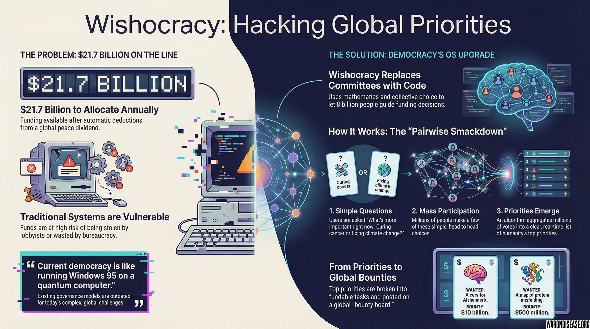
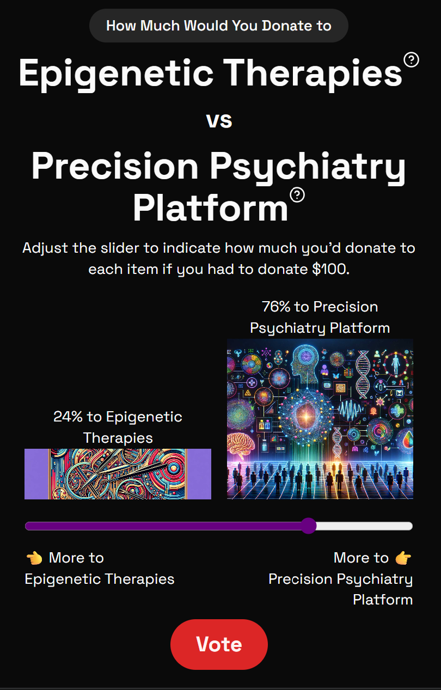



Once a [1% treaty](1-percent-treaty-academic.qmd) is ratified, /year flows into the 1% Treaty Fund.

However, not all of this is available for allocation. First, the automatic deductions apply:

| Allocation | Share | Amount | Purpose |
|:-----------|:------|:-------|:--------|
| [VICTORY Incentive Alignment Bond investors](../economics/victory-bonds-academic.qmd) |  |  | Repay campaign funders |
| [Political incentives (IABs)](incentive-alignment-bonds-academic.qmd) |  |  | Keep politicians aligned |
| **Available for Wishocracy** |  | **** | Funds available for allocation |

The challenge is preventing special interests from taking that  or bureaucracy from wasting it.

**Wishocracy** replaces committees with code and representatives with mathematics. This allows 8 billion people to collectively decide how to spend  without creating bureaucratic inefficiency.

## Allocating the 1% Treaty Fund: Decentralized Crowdfunding

The [decentralized institutes of health (DIH)](dih-academic.qmd) network functions as a **decentralized crowdfunding platform**. Anyone can submit a campaign proposal. Wishocracy allocates funds from the 1% Treaty Fund across competing campaigns.

### Functions handled automatically by a [decentralized framework for drug assessment (dFDA)](dfda-academic.qmd):

- **Which specific treatments get tested** → Companies register, patients choose
- **Which diseases get researched** → Patients join trials for their conditions
- **Resource allocation within pragmatic clinical trials** → Market prices and participant choices

### Decisions Made by Wishocracy:

**Allocation across campaign proposals competing for 1% Treaty Fund funds:**

#### Infrastructure Campaigns

- "Decentralized Framework for Drug Assessment Development" - $1B/year proposal
- "Epic EHR Integration Project" - $5M one-time
- "AWS Infrastructure Services" - $3M/year
- "Security Audit Program" - $2M/year
- "Alternative decentralized framework for drug assessment" - $8M/year (competing approach)

#### Public Goods (Market Failures)

- "Patient Trial Subsidies Program" - $800B/year (automatic formula)
- "Off-Patent Drug Research" - $20B/year
- "Rare Disease Initiative" - $10B/year
- "Negative Results Publishing Fund" - $5B/year

#### Service Provider Bids

- "Data Storage Provider A" - $2B/year
- "Data Storage Provider B" - $1.5B/year (competing)
- "Pragmatic Clinical Trial Insurance Pool" - $10B reserve

### How It Works: Pairwise Comparisons Between Campaigns

Rather than committees deciding "a framework for drug assessment gets $10B," the global population votes using pairwise comparisons:

**Examples of prioritization choices:**

- "Framework for drug assessment development" vs "Alzheimer's prize"?
- "Epic integration" vs "Security audits"?
- "Rare disease research" vs "An alternative drug assessment framework"?
- "Patient subsidies" vs "Infrastructure spending"?

Millions of people make simple pairwise choices. The algorithm aggregates preferences into funding allocations.

### Why This Is Necessary

This process cannot be reduced to simple formulas because:

1. **Multiple competing implementations** - Which decentralized framework for drug assessment to fund? Which infrastructure provider?
2. **Trade-offs between prizes** - $100B for aging reversal or $50B for Alzheimer's + $50B for cancer?
3. **Public goods allocation** - How much for off-patent drugs vs rare diseases?
4. **Service provider competition** - Which companies get contracts for what amounts?

A [decentralized framework for drug assessment (dFDA)](dfda-academic.qmd) allocates resources **within** pragmatic clinical trials. Wishocracy allocates resources **between** campaigns.

---

The core of Wishocracy is a voting method simple enough for general participation. It is called Aggregated Pairwise Preference Allocation.

The human brain struggles to rank a list of 20 priorities. Cognitive limits are reached around [item number seven](../references.qmd#cognitive-limit-seven-items). However, humans are effective at comparing two options.

Instead of asking users to "Rank these 10,000 problems," the system asks:

**"What's more important right now: Curing cancer or fixing climate change?"**

Participants make a choice. They do this a few times with different random pairs. It takes five minutes. Millions of other people do the same. An algorithm then takes these millions of simple, head-to-head comparisons and builds a real-time ranking of collective priorities.

This leverages the wisdom of crowds without requiring direct interaction between participants.

### Mathematical Validity

When millions of people make pairwise choices:

- Random pairs prevent gaming
- [Statistical models (Bradley-Terry, PageRank)](../references.qmd#bradley-terry-pagerank-models) extract global preferences
- Outliers cancel out
- Wisdom of crowds emerges

Example with real numbers:

- 5 million people vote
- Each makes 20 comparisons
- 100 million data points
- Algorithm computes results
- Output: "Society allocates 28% to healthcare, 22% to education, 15% to climate..."

This provides democratic input while allowing noise and individual error to cancel out.

## From Priorities to Projects

Once the allocation system identifies that "Curing Alzheimer's" is a top priority, Wishocracy translates that priority into action.

1.  **Decomposition by AI:** An AI takes the broad goal of "Cure Alzheimer's" and breaks it down into thousands of smaller, concrete, fundable tasks. "Cure Alzheimer's" becomes "Map protein structures," which becomes "Run AlphaFold on these sequences," which becomes "Rent computing time." Every difficult problem is a series of possible steps.

2.  **Incentive Marketplace:** These tasks are posted to a global marketplace.
    -   **WANTED:** A cure for Alzheimer's. **BOUNTY:** $10 billion.
    -   **WANTED:** A map of all protein misfolding patterns. **BOUNTY:** $500 million.

3.  **Global Competition:** Teams from around the world, from major universities to independent researchers, bid on these tasks. Multiple approaches are funded in parallel. The ones that show promise get more funding. The ones that fail are defunded. This functions as venture capital applied to survival outcomes.

## Existing Distributed Decision Systems

Current examples of distributed decisions include:

- Liking content on social media (micro-vote)
- Buying goods on Amazon (economic vote)
- Choosing a restaurant (quality vote)
- Swiping on dating apps (genetic vote)

These represent participation in distributed decision systems. Society operates as a hive mind, albeit a disorganized one.

Wishocracy organizes this input and directs it toward significant problems.

Current collective intelligence often focuses on:

- Viral entertainment
- Ad targeting optimization
- Wealth accumulation
- Social debates

This system directs it to:

- Cure diseases
- End poverty
- Fix climate
- Explore space
- Improve quality of life

The same collective intelligence is applied to better targets.

## Evolution of Governance Models

Early democratic models were designed for:

- 13 colonies
- 3 million people
- Slow physical communication
- Life expectancy of 40
- A limited number of issues

Representative democracy was designed for:

- Nation states
- Millions of people
- Telegraph communication
- Life expectancy of 60
- Dozens of issues

Wishocracy is designed for:

- Global civilization
- 8 billion people
- Instant communication
- Higher life expectancy
- Infinite, interconnected issues

This model is intended to operationalize democracy rather than replace it.

Will it be perfect? No.

Will it make mistakes? Yes.

Will it perform better than decisions driven by special interests and lobbying? Yes.