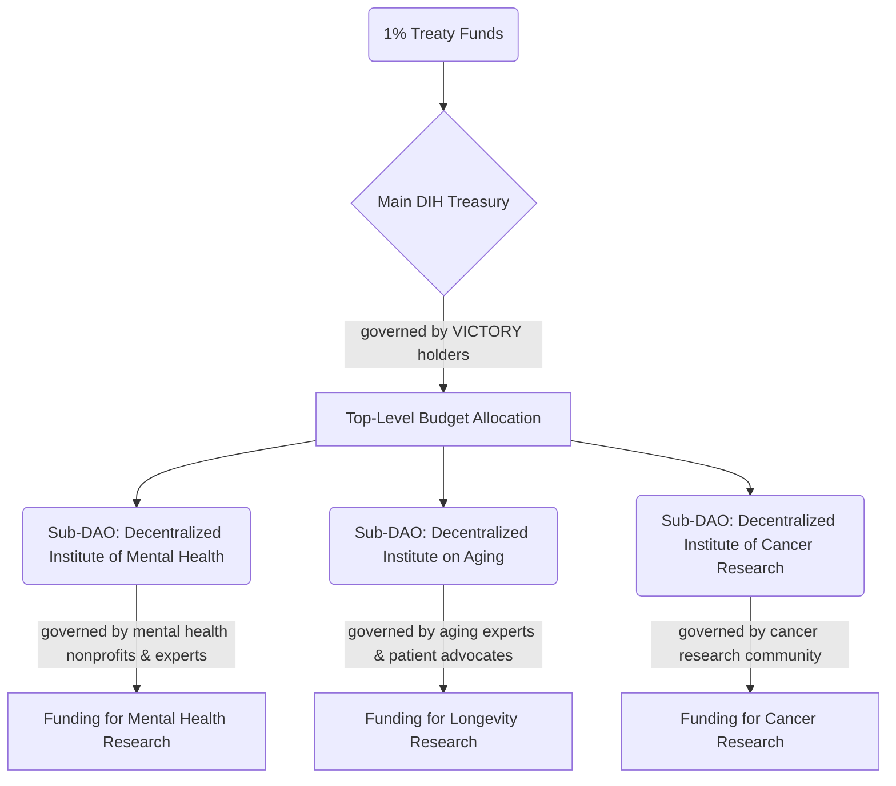

# 📖 Chapter 6: Legal & Governance

The legal and governance framework of the DIH is as critical as its financial model. It is engineered to navigate the complex landscape of international law, securities regulations, and political compliance while building a resilient, transparent, and effective institution.

Our structure is designed to be **robust by default and decentralized by design.**

---

## 1. The Multi-Entity Global Structure

To ensure compliance across multiple jurisdictions and separate distinct functions, the DIH operates through a multi-entity structure. This is not a single company; it is a coordinated network of legal entities with specialized roles.

-   **🇨🇭 A Swiss Foundation (Treaty Coordination & Treasury):** The primary entity, based in a neutral, crypto-friendly jurisdiction with a strong history in international law. This foundation will manage the main DIH Treasury that receives funds from the 1% Treaty.
-   **🇺🇸 A US-Based 501(c)(4) & Super PAC (Political Advocacy):** A completely segregated entity funded exclusively by US persons to engage in political advocacy and independent expenditures in the United States, in full compliance with federal election law. A strict information firewall will exist between the US and international entities.
-   **🇸🇬 A Singaporean Entity (Token Issuance):** An entity based in a jurisdiction with clear crypto regulations to manage the issuance and distribution of VICTORY instruments.
-   **🇪🇪 An Estonian Entity (Technology Development):** An entity based in a world leader in e-governance to oversee the development of the open-source dFDA platform.

This structure isolates risk and ensures that each part of the operation adheres to the specific legal requirements of its domain.

---

## 2. Securities Law Compliance by Design

The offering of **[VICTORY Bonds](./economics.md)** and their associated tokens requires rigorous adherence to global securities laws. Our strategy is designed to be compliant from day one.

-   **Accredited Investors First:** The initial capital will be raised from accredited and institutional investors via compliant private placements (e.g., Regulation D in the US). This provides a secure financial foundation.
-   **Utility-Focused Public Distribution:** Broader public participation will be managed through a utility-first model. Participants will initially earn non-financial "VOTE" points for taking actions that support the cause (e.g., signing the referendum). Only after the treaty is ratified and the system is functional will these points convert to governance tokens with real utility, mitigating the risk of them being classified as speculative securities upon initial distribution.
-   **Clear Disclaimers:** All marketing and communications will focus on the utility and purpose of the project, avoiding speculative language and providing clear disclosures about risk.

---

## 3. Decentralized by Default: The DIH Governance Model

The DIH is not a top-down bureaucracy. It is a "coalition of coalitions," designed to empower communities with direct control over the resources that matter to them.

-   **Top-Level Governance:** The main DIH Treasury is governed by holders of VICTORY instruments, who vote on the top-level allocation of the ~$27B+ annual budget to various disease areas.
-   **Sub-Institute DAOs:** The budget for each disease area (e.g., "Cancer Research") is controlled by a specialized sub-DAO.
-   **Community Control:** Governance of each sub-DAO is delegated to the stakeholders of that domain—the non-profits, patient advocacy groups, researchers, and clinics who are the experts in that field.

This model ensures that funding decisions are made by the people with the most knowledge and the greatest stake in the outcome, creating a resilient and effective system for global health innovation.
