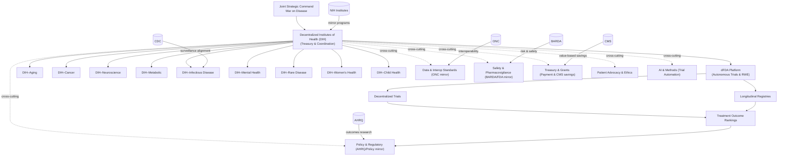

## Org chart

## Purpose

- Align thousands of orgs/communities behind the 1% Treaty referendum with clear homes and earned, criteria-based recognition.
- Create a lightweight mirror of legacy agencies to collaborate without implying government authority.

## Titles framework (earned recognition with guardrails)

- Institute Chair (volunteer, term-limited)
- Scientific Council Member
- Founding Fellow / Fellow
- Ambassador (regional or domain)
- Affiliate Partner (org-level)

Appointments are transparent, criteria-based, and revocable; all appointees sign code of conduct, conflict-of-interest, and brand-use policy. Public directory lists affiliations and disclosures.

## Minimal governance

- Automated-by-default. Human roles act as emergency custodians with explicit sunset/hand-off to contracts.
- Each institute uses a one-page charter and auto-generated OKRs/dashboards from oracles; no quarterly reports.
- Cross-cutting institutes provide shared services (standards, safety, ethics, treasury, AI) as APIs/contracts.

## Success metrics

- Orgs endorsed to the 1% Treaty, active projects funded, volunteer hours, trial participants subsidized, and referendum signatures attributed to institutes.

## Decentralization and automation blueprint

- On-chain treasury modules for grants, quadratic funding, patient subsidies, outcome bounties, and $VICTORY bonds
- Verifiable oracles for evidence, safety, identity/COI, and healthcare-savings estimates
- AI agents for trial design, monitoring, fraud detection, and funding triage
- Tokenless-first governance (reputation/credentials), merge-to-earn bounties, public proposals with on-chain execution
- Interop standards: HL7 FHIR/OMOP, DID/VC, EIP-712, IPFS/Arweave

See [DIH On-Chain and AI Architecture](../../architecture/dih-onchain-architecture.md) for technical details and [Incentives Layer](../incentives-layer.md) for social/economic incentives.

