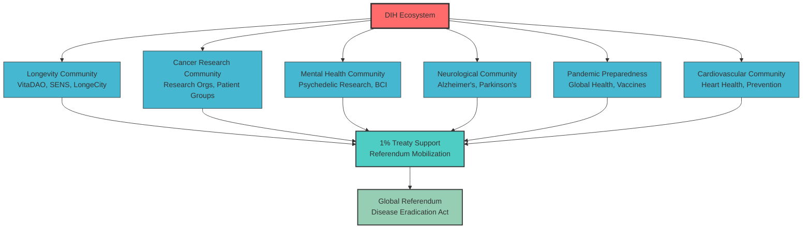
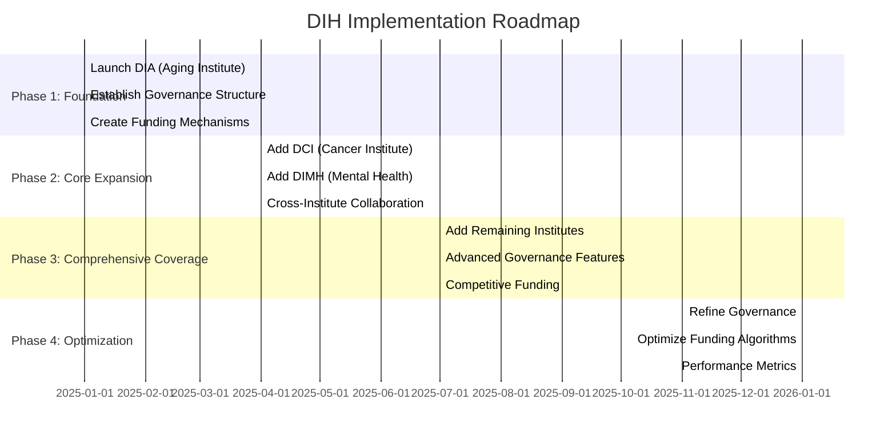
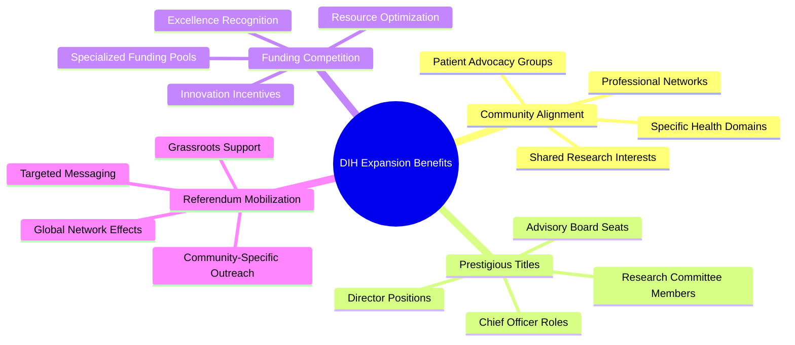

# DIH Organizational Chart - Visual Structure

## Complete DIH Ecosystem Overview

```mermaid
graph TD
    A[Joint Strategic Command<br/>War on Disease<br/>7-9 Members] --> B[DIH Central Administration<br/>DAO Treasury Management]
    
    B --> C1[Decentralized Institute on Aging<br/>DIA - $4.3B Mirror]
    B --> C2[Decentralized Cancer Institute<br/>DCI - $7.2B Mirror]
    B --> C3[Decentralized Institute of Mental Health<br/>DIMH - $2.2B Mirror]
    B --> C4[Decentralized Institute of Neurological Disorders<br/>DINDS - $2.6B Mirror]
    B --> C5[Decentralized Institute of Infectious Diseases<br/>DIID - $6.3B Mirror]
    B --> C6[Decentralized Institute of Cardiovascular Health<br/>DICH - $4.2B Mirror]
    B --> C7[Decentralized Institute of Diabetes & Metabolic Health<br/>DIDMH - $2.3B Mirror]
    B --> C8[Decentralized Institute of Addiction & Substance Research<br/>DIASR - $2.0B Mirror]
    B --> C9[Decentralized Institute of Child & Family Health<br/>DICFH - $1.8B Mirror]
    B --> C10[Decentralized Institute of Vision & Eye Health<br/>DIVEH - $0.9B Mirror]
    B --> C11[Decentralized Institute of Translational Sciences<br/>DITS - $0.9B Mirror]
    B --> C12[Decentralized Institute of Musculoskeletal Health<br/>DIMH - $0.7B Mirror]
    
    style A fill:#ff6b6b,stroke:#333,stroke-width:3px
    style B fill:#4ecdc4,stroke:#333,stroke-width:2px
    style C1 fill:#45b7d1,stroke:#333,stroke-width:1px
    style C2 fill:#45b7d1,stroke:#333,stroke-width:1px
    style C3 fill:#45b7d1,stroke:#333,stroke-width:1px
    style C4 fill:#45b7d1,stroke:#333,stroke-width:1px
    style C5 fill:#45b7d1,stroke:#333,stroke-width:1px
    style C6 fill:#45b7d1,stroke:#333,stroke-width:1px
    style C7 fill:#45b7d1,stroke:#333,stroke-width:1px
    style C8 fill:#45b7d1,stroke:#333,stroke-width:1px
    style C9 fill:#45b7d1,stroke:#333,stroke-width:1px
    style C10 fill:#45b7d1,stroke:#333,stroke-width:1px
    style C11 fill:#45b7d1,stroke:#333,stroke-width:1px
    style C12 fill:#45b7d1,stroke:#333,stroke-width:1px
```

## Detailed Sub-Agency Structure (Example: DIA)

```mermaid
graph TD
    A[Decentralized Institute on Aging<br/>DIA] --> B[Director of DIA<br/>Chief Executive Officer]
    
    B --> C1[Chief Longevity Officer<br/>Strategic Longevity Initiatives]
    B --> C2[Chief Anti-Aging Officer<br/>Anti-Aging Research Coordination]
    B --> C3[Chief Biomarker Officer<br/>Aging Biomarker Research]
    B --> C4[Chief Senescence Officer<br/>Cellular Senescence Research]
    
    C1 --> D1[Longevity Research Projects]
    C1 --> D2[Anti-Aging Interventions]
    C1 --> D3[Life Extension Technologies]
    
    C2 --> D4[Senescence Research]
    C2 --> D5[Rejuvenation Therapies]
    C2 --> D6[Age Reversal Studies]
    
    C3 --> D7[Biomarker Discovery]
    C3 --> D8[Age Prediction Models]
    C3 --> D9[Healthspan Metrics]
    
    C4 --> D10[Cellular Senescence]
    C4 --> D11[Senolytic Therapies]
    C4 --> D12[Senescence Prevention]
    
    style A fill:#ff6b6b,stroke:#333,stroke-width:2px
    style B fill:#4ecdc4,stroke:#333,stroke-width:2px
    style C1 fill:#45b7d1,stroke:#333,stroke-width:1px
    style C2 fill:#45b7d1,stroke:#333,stroke-width:1px
    style C3 fill:#45b7d1,stroke:#333,stroke-width:1px
    style C4 fill:#45b7d1,stroke:#333,stroke-width:1px
    style D1 fill:#96ceb4,stroke:#333,stroke-width:1px
    style D2 fill:#96ceb4,stroke:#333,stroke-width:1px
    style D3 fill:#96ceb4,stroke:#333,stroke-width:1px
    style D4 fill:#96ceb4,stroke:#333,stroke-width:1px
    style D5 fill:#96ceb4,stroke:#333,stroke-width:1px
    style D6 fill:#96ceb4,stroke:#333,stroke-width:1px
    style D7 fill:#96ceb4,stroke:#333,stroke-width:1px
    style D8 fill:#96ceb4,stroke:#333,stroke-width:1px
    style D9 fill:#96ceb4,stroke:#333,stroke-width:1px
    style D10 fill:#96ceb4,stroke:#333,stroke-width:1px
    style D11 fill:#96ceb4,stroke:#333,stroke-width:1px
    style D12 fill:#96ceb4,stroke:#333,stroke-width:1px
```

## Funding Flow Structure

```mermaid
graph TD
    A[1% Treaty Contributions<br/>Global Military Budgets] --> B[DIH Central Treasury<br/>$20B+ Annual Pool]
    
    B --> C1[DIA Funding Pool<br/>Aging Research]
    B --> C2[DCI Funding Pool<br/>Cancer Research]
    B --> C3[DIMH Funding Pool<br/>Mental Health]
    B --> C4[DINDS Funding Pool<br/>Neurological Research]
    B --> C5[DIID Funding Pool<br/>Infectious Disease]
    B --> C6[DICH Funding Pool<br/>Cardiovascular Health]
    B --> C7[DIDMH Funding Pool<br/>Diabetes & Metabolic]
    B --> C8[DIASR Funding Pool<br/>Addiction Research]
    B --> C9[DICFH Funding Pool<br/>Child & Family Health]
    B --> C10[DIVEH Funding Pool<br/>Vision & Eye Health]
    B --> C11[DITS Funding Pool<br/>Translational Sciences]
    B --> C12[DIMH Funding Pool<br/>Musculoskeletal Health]
    
    C1 --> D1[Patient Trial Subsidies]
    C1 --> D2[Research Grants]
    C1 --> D3[Innovation Prizes]
    
    C2 --> D4[Patient Trial Subsidies]
    C2 --> D5[Research Grants]
    C2 --> D6[Innovation Prizes]
    
    style A fill:#ff6b6b,stroke:#333,stroke-width:3px
    style B fill:#4ecdc4,stroke:#333,stroke-width:2px
    style C1 fill:#45b7d1,stroke:#333,stroke-width:1px
    style C2 fill:#45b7d1,stroke:#333,stroke-width:1px
    style C3 fill:#45b7d1,stroke:#333,stroke-width:1px
    style C4 fill:#45b7d1,stroke:#333,stroke-width:1px
    style C5 fill:#45b7d1,stroke:#333,stroke-width:1px
    style C6 fill:#45b7d1,stroke:#333,stroke-width:1px
    style C7 fill:#45b7d1,stroke:#333,stroke-width:1px
    style C8 fill:#45b7d1,stroke:#333,stroke-width:1px
    style C9 fill:#45b7d1,stroke:#333,stroke-width:1px
    style C10 fill:#45b7d1,stroke:#333,stroke-width:1px
    style C11 fill:#45b7d1,stroke:#333,stroke-width:1px
    style C12 fill:#45b7d1,stroke:#333,stroke-width:1px
    style D1 fill:#96ceb4,stroke:#333,stroke-width:1px
    style D2 fill:#96ceb4,stroke:#333,stroke-width:1px
    style D3 fill:#96ceb4,stroke:#333,stroke-width:1px
    style D4 fill:#96ceb4,stroke:#333,stroke-width:1px
    style D5 fill:#96ceb4,stroke:#333,stroke-width:1px
    style D6 fill:#96ceb4,stroke:#333,stroke-width:1px
```

## Community Alignment Network

## Implementation Timeline

## Key Benefits Visualization

---

## Chart Legend

- **Red (Primary)**: Joint Strategic Command and main decision points
- **Teal (Secondary)**: DIH Central Administration and major coordination points
- **Blue (Tertiary)**: Individual institutes and sub-agencies
- **Green (Quaternary)**: Specific projects, initiatives, and outcomes

## Usage Notes

These charts are designed to be:
1. **Interactive**: Can be rendered in any Mermaid-compatible viewer
2. **Scalable**: Easy to modify as the structure evolves
3. **Clear**: Simple visual hierarchy showing relationships
4. **Comprehensive**: Covers all aspects of the DIH ecosystem

For the complete text-based organizational structure, see [DIH Organizational Structure](dih-organizational-structure.md).
