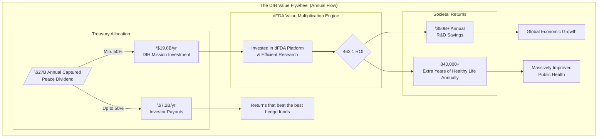

## Art Direction & Visual Concept

This document serves as the content and creative brief. The aesthetic should be minimalistic, authoritative, and reminiscent of high-value financial documents like currency or bond certificates. The goal is to visually communicate that this is a serious, systematic financial and political re-engineering, not just a moral plea.

### Overall Aesthetic
-   **Palette:** A stark, monochromatic scheme using "banknote green," black, and a creamy, off-white background similar to currency paper.
-   **Typography:**
    -   **Headlines:** Large, high-contrast serif fonts (e.g., Bodoni, or a modern equivalent of engraving typefaces found on currency).
    -   **Body Text:** A clean, highly readable sans-serif.
-   **Layout:** Generous use of whitespace. Content should be centered or in clean, single columns to feel deliberate and uncluttered.
-   **Graphics & Illustrations:** All graphical elements should follow an engraving or etching style. Data visualizations must be clean, powerful, and minimalistic.
-   **Decorative Elements:** Subtle guilloché patterns (the intricate, lathe-work lines on banknotes) can be used as borders, section dividers, or background watermarks to reinforce the financial aesthetic.

### Visual Storyboard

1.  **Hero Section (Above the Fold)**
    -   **Content:** "War is fucking stupid. Diseases suck. But governments spend 40X more on militarism than finding cures for diseases."
    -   **Visuals:** Purely typographic. The text should be set in a massive font size, centered on the screen against the off-white paper background. The immediate impression is one of brutal, undeniable honesty. No images.

2.  **The Core Problem Data Visualization**
    -   **Content:** The section comparing the \$2.72 trillion in military spending to the \$67.5 billion in medical research spending.
    -   **Visuals:** A single, powerful data visualization. A massive horizontal bar chart is ideal.
        -   **Bar 1 (Military Spending):** A long, banknote-green bar stretching nearly the full width of the screen. Labeled: **MILITARY & WAR SPENDING: \$2,718,000,000,000**.
        -   **Bar 2 (Medical Research):** A tiny, almost invisible sliver of a bar directly below it. Labeled: **MEDICAL RESEARCH SPENDING: \$67,500,000,000**.
    -   The visual contrast should be so extreme that it feels shocking and absurd, instantly communicating the scale of the misallocation without needing complex charts.

3.  **The Solution Value Flow Visualization**
    -   **Content:** The "Here's How We Fix It" and "Why This Works" sections.
    -   **Visuals:** A clean **Sankey diagram** to illustrate the flow of capital. This visualizes the "legal bribery" as a systematic financial plan.
        -   **Source Node (Left):** A large box labeled "**1% Global Military Budget Redirection: \$27 Billion/Year Treasury**".
        -   **Flows (Center):** Thick, engraved-style lines representing the capital allocation.
        -   **Destination Nodes (Right):** Clearly labeled boxes showing the distribution (e.g., `\$56M -> Referendum Voters`, `\$1.5B -> Political Action Fund`, `\$25.4B -> Decentralized Institutes of Health`).

4.  **Detailed Sections (Objections, Q&A)**
    -   **Content:** The detailed explanatory and argumentative sections.
    -   **Visuals:** These sections should be purely typographic to convey seriousness and authority. Use a clean, two-column layout where appropriate. Small, iconic illustrations in the engraving style can be used as section dividers (e.g., a stylized scale of justice for the legal section, a key for the objections section). The feel should be akin to a prospectus or a formal whitepaper.

5.  **Call to Action (CTA) Sections**
    -   **Content:** "Start Earning Now" and "For Institutions."
    -   **Visuals:** Buttons and interactive elements should be styled to look like official seals or the ornate corners of a bond certificate. The text on buttons ("Get Your Referendum Link," "Invest in \$VICTORY") should reinforce the transactional and high-value nature of the actions.

---

# Part 1: The Unacceptable Reality

## War is fucking stupid. Diseases suck.

## But governments spend 40X more on militarism than finding cures for diseases.

## The Pentagon loses more money by accident than humanity spends on curing cancer.

---

## The Simple Truth

Governments spend **[\$2.72 trillion](https://www.sipri.org/publications/2025/sipri-fact-sheets/trends-world-military-expenditure-2024)** on military and **[\$67.5 billion](../reference/global-government-medical-research-spending.md)** on finding cures for diseases. That's a **40X disparity**.

The Pentagon alone [can't account for \$2.5 trillion](#pentagon-unaccounted-2-5t) in assets—250 times larger than what we're asking them to redirect. **They lose more money by accident than we need to cure cancer.**

We haven't cured a single disease in [over 50 years](#smallpox-eradicated). Meanwhile, we have [enough nuclear bombs to kill all of humanity twice](#nuke-winter-150tg).
In our evolutionary past, a world with scarce resources, violence was necessary for survival. But today we live in a world with enough food for everyone.  In fact, nearly all starvation today is actually the RESULT of violent conflict.

So humanity has 2 paths:
1. Continue on a path of escalating conflict, risking self-inflicted extinction.
2. Engineer a new system that aligns our vast resources with our collective survival and well-being.

Pick one.

---

## Costs of War vs Disease (Context)

See [1% Treaty](./1-percent-treaty/1-percent-treaty.md) for quantified savings and ROI. For a detailed breakdown of direct and indirect costs of war, see [Quantified Costs of War](../reference/costs-of-war.md).

---

## This Sounds Too Good to Be True. Here's Why It's Not.

**"A $2.5B investment to capture $27B annually? Come on."**

Fair skepticism. Here's why the math actually works:

**1. We're Not Asking for New Money—We're Redirecting Waste**
- The Pentagon [literally cannot account for $2.5 trillion](#pentagon-unaccounted-2-5t) in existing assets
- Our ask: $10B annually from the US (0.4% of their unaccounted waste)
- This isn't "find new money"—it's "stop losing the money you already have"

**2. The Efficiency Gains Are Already Proven**
- Oxford RECOVERY trial: [$500 per patient vs. $41,000 traditional](#recovery-cost-500)—80X cheaper
- Result: [Saved over 1 million lives globally](../reference/recovery-trial.md) by identifying effective COVID treatments
- NIH RECOVER: [$1.6 billion, zero completed trials in 4 years](../reference/recovery-trial.md)
- **This isn't theoretical. It already happened.**

**3. Political Mobilization at Scale Works**
- [3.5% mobilization has never failed](#3-5-rule) in recorded history (Chenoweth, Harvard)
- Net neutrality: 4 million comments forced FCC policy change in 2015
- War bonds: [$185 billion raised from 85 million Americans](#wwii-war-bonds) during WWII
- **Precedent exists. The mechanisms work.**

**4. The Peace Dividend Is Real Economics, Not Crypto Speculation**
- [$16.5 trillion annual cost of violence](#global-violence-costs) (Institute for Economics & Peace)
- We capture 0.16% of this—investors get $27B, society gets $16.473T
- **This is value capture from waste reduction, not digital asset speculation**

**5. Military Contractors Will Switch for Better Returns**
- Return: [$1,813 per $1 spent on lobbying](#lobbying-roi-calc)
- Our offer: Direct investment in bonds with >40% CAGR + governance of $27B treasury
- **When the math favors peace, rational actors choose peace**

**The Bottom Line:** We're not creating money out of thin air. We're redirecting money that's already being wasted into a system that produces 80X better results with mathematical precision.

---

## Why Good Intentions Have Failed

For centuries, we've known war brings suffering. Yet we fund it anyway. Why?

Military contractors earn billions. Politicians receive generous donations. The cycle continues.

## Our Answer: Legal Bribery for Peace

We will not change minds with morals. We will make curing people more profitable than killing them.

**Current incentives reward weapons over cures:**
- Military contractors: [\$10 billion contracts](#statista-mil-spending)
- Politicians: [\$100+ million in lobbying annually](#lobbying-100m)
- Result: More weapons, less security

**We offer better returns:**
- Citizens: Paid in `\$VOTE` points for each referendum vote they generate (convertible to `\$VICTORY` post‑treaty per [Legal Compliance Framework](./legal-compliance-framework.md))  
- Organizations: Partner referral rewards for verified votes via your org’s link; tiered bonus pools and leaderboards for coalitions
- Politicians: Backed with independent expenditures when they vote with their district’s referendum result

- Institutions: Double or triple their research funding

We choose to make curing people more profitable than killing them.

---

# Part 2: How It Works

## Here's How We Fix It:

**The Goal: Make curing people more profitable than killing them.** 

**Step 1:** Give everyone on Earth a stake in the outcome. Reward every person who votes on the global referendum with **`$VOTE` points**—your verifiable claim to a share of the [$16.5 trillion annual peace dividend](../economic-models/peace-dividend-value-capture.md) you help create (see [Legal Compliance Framework](./legal-compliance-framework.md)).

**Step 2:** When we hit [3.5% of humanity](#3-5-rule), we have proof the world wants this.

**Step 3:** After the treaty is ratified, `$VOTE` points become convertible to `$VICTORY` governance tokens—your earned ownership stake in the **$27B+ annual health treasury** you helped create by redirecting global military spending (see [\$VICTORY Instruments — Tokenomics](./1-percent-treaty/victory-bonds-tokenomics.md)).

**Step 4:** Build a legal political engine: independent‑expenditure committees that pledge massive support for candidates who vote with their district’s referendum result—and fund challengers against those who defy it.

**Step 5:** The treasury funds EVERYONE in health - universities, pharma, nonprofits, government agencies - through democratically controlled funding pools.

---

## Activation Energy Sequence: Who We Bribe First

**Phase 1: Seed Investors (\$250-400M Initial Investment)**
- **Who:** Wealthy individuals, funds, Anchor Investors
- **Bribe:** 
  - **Targeting a >40% CAGR (~28x Return):** Our financial model is engineered to deliver a risk-adjusted return superior to the world's most elite investment funds (e.g., Renaissance Medallion Fund's ~39% CAGR). Payouts are governed by two clear principles: a target to deliver a ~28x return to early investors, and a guarantee that at least 50% of annual income is always reserved for our health mission. See our [Investment Thesis](../economic-models/victory-bond-investment-thesis.md) and [Cash Flow Model](../economic-models/dih-treasury-cash-flow-model.md).
  - **\$VICTORY governance tokens** controlling the \$27B annual DIH treasury.
  - **De-Risked Investment:** Initial funds are protected by an [Assurance Contract](../economic-models/fundraising-strategy.md), guaranteeing a full refund if fundraising goals are not met.
- **Why they bite:** The potential for a historic, de-risked, and transparently-governed return, plus control over a massive global health treasury.

**Phase 2: \$VICTORY Token Buyers (\$100-200M Referendum Funding)**
- **Who:** Early Backers, health advocates, institutions
- **Bribe:**
  - \$VICTORY tokens representing earned ownership of real economic value created by the [peace dividend](../economic-models/peace-dividend-value-capture.md)
  - Governance control over \$27B annually in captured value from military budget redirection
  - Vote on patient subsidies and research funding allocation
  - Token value backed by actual treasury growth from treaty implementation (\$0 → \$27B)
- **Why they bite:** Early ownership stake in humanity's largest value-creation event—capturing the peace dividend through systematic military-to-health reallocation

**Phase 3: Citizens (Global Population)**
- **Who:** Global population (targeting 3.5% = 280M people)
- **Bribe:** A large grant of **`$VOTE` points** for each referendum vote—your verifiable claim to real economic value you help create. These represent your earned share of the [$16.5 trillion annual peace dividend](../economic-models/peace-dividend-value-capture.md) unlocked by redirecting military spending, convertible to **`$VICTORY` governance tokens** after the 1% Treaty is ratified.
- **Why they bite:** They earn a direct, meaningful stake in the economic value they help create for humanity. It transforms them from simple voters into owners of the wealth they generate by ending the military-industrial waste.

**Phase 4: Politicians (\$800M-1.5B Independent Expenditures)**
- **Who:** Key legislators in target countries
- **Bribe:** 
  - **Personal Wealth Creation:** Early access to [\$VICTORY Bonds](../economic-models/victory-bond-investment-thesis.md) with superior returns designed to outperform defense stocks and traditional political corruption
  - **Campaign Dominance:** Massive campaign support for treaty supporters, equivalent opposition funding for defectors
  - **Family Security:** Their families get diseases too—profit from funding cures rather than weapons
- **Why they bite:** Personal wealth growth + 280M verified voters + overwhelming campaign funding vs. military contractors' modest donations and \$15M lobbying budget

**The Compounding Effect:** Each phase funds the next. Seed investors control governance of \$27B treasury. Token buyers fund the referendum. Citizens create electoral pressure. Politicians pass treaties. Everyone gets paid more than they could anywhere else.

---

## The Treasury Model

**[\$VICTORY Bonds](./1-percent-treaty/victory-bonds-tokenomics.md):** Bootstrap funding now, repaid by treaty inflows.

**[Decentralized Institutes of Health (DIH)](./1-percent-treaty/decentralized-institutes-of-health.md):** A treasury that funds research 80X cheaper. The DIH doesn't fund the [old, broken system](../problems/problems-in-clinical-research.md)—it funds a **decentralized FDA (dFDA) platform** with proven results:

-   **[80X Greater Efficiency](../reference/recovery-trial.md):** The dFDA model cuts per-patient trial costs from [\$41,000](#trial-cost-41k) to as low as [\$500](#recovery-cost-500), an 80X efficiency gain **already proven** by the [Oxford RECOVERY trial](../reference/recovery-trial.md), which saved over 1 million lives globally.
-   **[\$50 Billion in Annual Savings](../economic-models/dfda-cost-benefit-analysis.md):** By making research cheaper and faster, the dFDA is projected to save the global R&D industry ~\$50 billion annually—**based on actual performance data, not projections**.
-   **[840,000+ Extra Years of Healthy Life](../economic-models/dfda-cost-benefit-analysis.md):** The platform is projected to generate over 840,000 extra years of healthy life annually through faster drug access and new therapies—**scaling proven results, not theoretical models**.

**Specialized programs fund existing institutions:** 
- Decentralized Institute of Mental Health → funds universities, pharma, nonprofits working on depression, anxiety, etc.
- Decentralized Institute of Cancer Research → funds MD Anderson, pharmaceutical companies, patient advocacy groups
- Decentralized Institute of Aging → funds longevity research at every institution

**Everyone gets more money, powered by a system that actually works. No one gets displaced.**

---

## Security & Anti-Corruption: Building Uncorruptible Institutions

**The Challenge:** A \$27B treasury is a massive target for hackers, fraudsters, and corrupt actors. Traditional DAOs with simple multisig controls have proven vulnerable to both technical exploits and social engineering attacks.

**Our Multi-Layered Defense:**

**1. True Decentralized Control (Proven at Scale)**
- Every \$VICTORY token holder directly controls treasury through on-chain voting (MakerDAO/Uniswap model)
- No human signers = no kidnapping, corruption, or coercion targets
- Smart contracts automatically execute community decisions after 24-72h timelocks
- Battle-tested approach managing billions in existing DAOs

**2. AI-Powered Fraud Detection**
- Fraud Agent: real-time anomaly detection, duplication monitoring, collusion identification, sybil detection
- Safety Oracle: incident severity scoring with automatic payout holds for affected interventions
- Manual review queue for flagged actions with whistleblower bounty rewards
- Identity Oracle: verifies affiliations and conflicts, prevents unauthorized access

**3. Complete Transparency & Auditability**
- All treasury addresses published with real-time public dashboards
- Immutable transaction logs with standardized disbursement tags
- Annual smart contract audits and semiannual operational audits with published reports
- Hash-committed invoices and budgets for full accountability

**4. Recovery & Response Mechanisms**
- Clawbacks for data falsification or trial misconduct
- Emergency pause capabilities triggered by incident signals
- Progressive unpause policies tied to remediation completion
- Guardian modules for pausing non-critical functions under defined conditions

**Beyond Health: A Template for Uncorruptible Governance**

This isn't just about protecting health funding - it's an experiment in building the next generation of radically more efficient, transparent, and corruption-resistant public institutions. Using proven DAO models that already manage billions (MakerDAO, Uniswap, Aave), we demonstrate that \$27B can be managed with:

- **Zero human targets** for violence, kidnapping, or corruption
- **True community control** through direct token holder governance
- **Complete transparency** with all decisions and executions on-chain
- **Automated efficiency** eliminating bureaucratic waste and political favoritism

**Applications Beyond Health:**
- **Education systems**: Community-controlled funding based on learning outcomes
- **Infrastructure projects**: Algorithmic allocation based on measurable public benefit
- **Environmental protection**: Outcome-based funding for verified climate impact
- **Social services**: Transparent, efficient distribution based on demonstrated need and effectiveness

**The Vision:** Replace corrupt, inefficient bureaucracies with transparent, automated, outcome-driven institutions that actually serve the public interest. The DIH treasury becomes the prototype for a new era of public governance - one that eliminates human corruption points entirely while delivering measurable results.

This experiment could usher in a new era of peace, prosperity, and abundance by proving that large-scale public goods can be managed through true decentralization without any centralized control points.

---

# Part 3: The Plan

## Why This Works

**Human nature unchanged:** People respond to incentives. We make the right choice profitable.

**Power follows money:** When curing people pays better than killing them, power shifts to healers.

**Safety in numbers:** All nations move 1% together. No one gains advantage or loses ground.

The strategic risk of non-compliance by some nations is minimal. Global military spending is already highly asymmetric; a 1% budget shift does not materially alter the balance of power.

The Pentagon cannot account for **[\$2.5 trillion in assets](#pentagon-unaccounted-2-5t)**. The U.S. contribution to this plan is **\$10 billion per year**. We are asking to redirect an amount equal to **0.4%** of the money they have already lost.

**Proof before action:** The referendum shows the world's will before any nation commits.

**Existing institutions win:** Universities, hospitals, research centers—all receive more funding than ever before.

---

### Historical Precedents (Why this playbook wins)

- Decentralized coalitions can create binding law: the International Campaign to Ban Landmines led to the 1997 Ottawa Treaty (see [ICBL](#icbl-ottawa-treaty)).
- Mobilizing private capital for public missions works: [World War II war bonds](#wwii-war-bonds) financed national efforts at scale.
- New global health institutions can marshal billions effectively: the [Global Fund to Fight AIDS, Tuberculosis and Malaria](#global-fund) proves rapid, coordinated international funding is achievable.

---

## The Personal Wealth Economics

**Military contractors' personal enrichment model:**
- [\$1.1 billion lobbying](#lobbying-1-1b) (2001-2021) → [\$2.02 trillion contracts](#contracts-2-02t)
- **Return: \$1,813 per \$1 spent on lobbying**
- Politicians get modest campaign donations and revolving door jobs

**What we're asking politicians to redirect:**
- 1% of \$2.72T = **\$27 billion annually** in military contracts
- Military contractors would spend ~**\$15 million in lobbying** to defend that revenue

**Our superior offer to politicians (legal and more profitable):**
- **Personal Investment Opportunity:** Politicians and their families can directly invest in [\$VICTORY Bonds](../economic-models/victory-bond-investment-thesis.md) designed to outperform any alternative investment, including defense stocks. When your personal portfolio grows faster by supporting the treaty, the choice is obvious.
- **Campaign Support:** Independent expenditures providing massive ad buys and ground game support for treaty supporters; equivalent opposition funding for defectors (no coordination).
- **Electoral Insurance:** The [3.5%](#3-5-rule) public mandate makes supporting the treaty the safer political choice.

**The math:** We offer politicians more personal wealth than military contractors ever could, PLUS better campaign support, PLUS the moral high ground of saving lives. It's not even close.

---

## Referendums vs Independent Expenditures

- **Referendums (where binding and timely):** Highest legitimacy; durable mandate; use when national or state mechanisms exist and timelines are practical.
- **Advisory signals (where no referendum):** Run scientifically credible polling or representative citizen assemblies; publish verified tallies per district.
- **Independent expenditures:** Fastest lever to translate district will into votes; pledge support for lawmakers who vote with their district’s verified result (and oppose those who defy it), with strict no‑coordination.
- **Hybrid playbook:** Use the global referendum for umbrella mandate; use country/district signals to direct lawful independent expenditures.

## Legal Compliance (jurisdiction‑specific)

- **United States:** Use independent‑expenditure committees (Super PACs). No coordination with campaigns; comply with FEC reporting and disclaimer rules; respect the foreign‑national ban (funds and decision‑making must be from U.S. persons for U.S. elections) [FEC guidance](#fec-foreign-nationals).
- **EU/UK/Canada/Japan and others:** Use lawful local equivalents (third‑party campaigners, non‑party campaigners, PACs). Separate, jurisdiction‑specific entities; local counsel review; segregated banking and governance.
- **No quid‑pro‑quo contracts:** No smart‑contract triggers tied to legislative votes. Rewards are independent expenditures based on public, verified district will.

---

## Implementation Roadmap

See the consolidated plan: [Canonical Roadmap — 1% Treaty → DIH → dFDA](./roadmap.md).

**Phase 1 (Months 1-12):** Build global referendum platform; secure initial \$250M financing tranche; launch in 5 pilot countries.

**Phase 2 (Months 12-24):** Achieve 3.5% global participation; begin independent expenditures in priority elections; first binding referendum votes.

**Phase 3 (Months 24-36):** Secure first national treaty commitments; establish DIH treasury operations; begin institutional funding.

**Phase 4 (Months 36-48):** Scale to major powers (US, EU, China); achieve \$27B+ annual inflows; full operational deployment.

**Phase 5 (Years 4+):** Begin the multi-generational endgame. After a successful proof-of-concept period, initiate referendums for incremental increases to the redirection (e.g., to 1.5%, then 2%), creating a perpetual flywheel for peace. For details, see [The Endgame: A Multi-Generational Strategy to Phase Out War](./the-endgame-phasing-out-war.md).

**Key Gates:** 100M referendum participants → first \$500M independent expenditure cycle → first treaty ratification → first \$1B disbursement.

---

## Investment Required vs. Returns

**Total Implementation Cost:** \$1.2-2.5B over 36 months

**What This Buys:** For a detailed breakdown of our multi-phase fundraising strategy and a line-item budget, see our full [Fundraising & Budget Plan](../economic-models/fundraising-and-budget-plan.md).
- Global referendum "Proof-of-Vote" points platform (~$5-10M)
- Independent expenditures in priority elections (~$800M-1.5B)
- Strategic incentive alignment to co-opt the MIC (~$100-200M)
- Platform development and pilot programs (~$250-400M)
- Legal compliance and treaty framework (~$100-200M)

**Annual Returns Once Operational:** \$27B+ per year from 1% military budget redirections

**ROI Timeline:** 18-36 months after first treaty ratification

**Break-even Analysis:** Even in a conservative partial success scenario where only the **US, EU, & UK** participate (generating **\$13B annually**), the system generates a **cash payout of \$6.5B (2.6X the initial \$2.5B investment)** in the first year of operation alone.

**The Math:** We're asking for \$2.5B to redirect \$27B annually. That's a 10:1 return ratio - better than most venture capital investments, except this one saves millions of lives.

---

## Financing Structure: Principled, Transparent, and Fair

Our financing is not based on complex, opaque structures. It is governed by two core, transparent principles that ensure a fair balance between rewarding investors and fulfilling our mission.

1.  **The Target Return Principle (The "Ceiling"):** We aim to deliver the world's best risk-adjusted return, targeting a **~40% compound annual growth rate (CAGR)** (~28x over 10 years) for our early investors.
2.  **The Mission Guarantee Principle (The "Floor"):** To protect our ultimate goal, annual investor payouts will **never exceed 50% of the DIH's total annual income.**

The model is designed to **front-load investor returns**, paying out the target amount (~$7.23B per year in the full success scenario) as quickly as treaty inflows allow. The 40% CAGR represents the total 10-year return, while the large year-one payout reflects our strategy of rapidly de-risking the investment for our partners.

This simple model ensures that even in conservative scenarios, the DIH remains massively well-funded while providing returns that beat the best hedge funds. For a complete breakdown, see our [Dynamic Cash Flow Model](../economic-models/dih-treasury-cash-flow-model.md).

---

## Why 1% Less Military = More Security

**Modern weapons make everyone less safe:**
- Nuclear weapons: [1% fewer = ~120 fewer nukes worldwide](#world-warheads)
- AI weapons systems: Reduce global AI arms race escalation  
- Cyber warfare tools: Less proliferation of attack capabilities

**Real security threats are health-based:**
- [Pandemics kill more people than wars](#pandemics-vs-wars) (COVID-19: 7M+ deaths vs. annual conflict deaths ~100K)
- Antibiotic resistance could kill [10M/year by 2050](#amr-10m-2050)
- [Mental health crises destabilize societies](#mental-health-burden) more than foreign armies

**1% reallocation = stronger nations:**
- Healthier populations are more productive
- Medical breakthroughs boost economic competitiveness
- Reduced healthcare costs free up MORE budget for military spending if needed

### The Ultimate Failsafe: The Worst-Case Scenario is Still a Win

Even if the Decentralized Institutes of Health were a completely inefficient failure and dumped every single dollar into the ocean, the world would *still* be better off.

Why?

Because we would still have **1% fewer nuclear weapons**. We would still have a **1% slower AI arms race**. We would still have a **1% reduction in the global capacity for organized violence.**

The worst possible outcome of this plan—total waste—is still a net gain for global security. The best possible outcome is that we also cure cancer.

### The Peace Dividend: The Economic Engine of Victory

The financial power of this model comes from capturing the first, tangible portion of the **$16.5 trillion annual "Cost of Violence"**—the single largest pool of misallocated capital on the planet.

*   **The Captured Dividend:** We redirect **$27 billion annually** from military spending to health. This tangible cash flow is the *captured* portion of the Peace Dividend that directly backs our financial instruments.
*   **The Societal Dividend:** By reducing global conflict drivers by 1%, our intervention unlocks a much larger prize for the world. A 1% reduction of the $16.5T Cost of Violence equates to **$165 billion in annual economic value** returned to society through increased stability and productivity.

We capture the first $27B to unlock the full $165B for everyone. For a detailed breakdown, see [The Peace Dividend: Value Capture & Distribution Model](../economic-models/peace-dividend-value-capture.md).

---

# Part 4: Objections & Rebuttals

## Why This Approach?

**1. "Why not just rely on philanthropy?"**

Relying on donations would force us to compete with the very ecosystem we aim to support. Philanthropy is a finite, zero-sum game. A massive fundraising campaign for the DIH would inevitably cannibalize the existing pool of donations, effectively stealing funds from the thousands of vital health charities already doing critical work. This would harm the cause, not help it.

Our goal is not to reshuffle a small pot of charitable giving. It is to tap into the multi-trillion dollar firehose of government spending.

Furthermore, philanthropy treats the symptoms of a broken system. It doesn't change the underlying political-economic incentives that perpetuate the problem. We are not just trying to fund more research; we are trying to permanently shift the global allocation of capital and talent from destruction to creation. Only a systemic reallocation can achieve that.

**2. "Why redirect military spending? Why not just increase the health budget?"**

This is not about nominal dollar figures; it is about the **real allocation of a finite pie of resources**. The world's top scientists, engineers, and manufacturing capacity are a limited resource. What matters is not the absolute dollar amount spent on health, but the *percentage* of our collective talent and capital dedicated to it, as this is the true surrogate for resource allocation.

If we simply "increase health spending" by 10% through new appropriations, but the central bank also expands the money supply and the military budget grows by 10%, **no real resources have been shifted**. It's an inflationary wash. The same scientists and factories will continue to build weapons because that's where the larger share of the economic pie remains.

A **direct, treaty-bound reallocation** is the only mechanism that forces a true shift of these finite resources. By cutting 1% from military budgets, we are not just moving dollars; we are freeing up the physicists, data scientists, and supply chains that were serving the military-industrial complex and making them available to cure Alzheimer's. This is how you change the game.

## Why This Isn't Completely Insane

**1. "This sounds like a cynical, illegal bribe. You'll have no soul."**

*   **Reality:** The current system of "legal" lobbying is a slow, inefficient bribe that produces war, disease, and existential risks like nuclear apocalypse or Skynet. Our transparent incentives produce peace, health, and human flourishing. In a world where leaders fund campaigns with crypto and sell access, we're applying market realities to save lives. The consequentialist math is clear: continued misallocation leads to preventable deaths, destruction, and possible extinction. Our "soul" is in the outcome: preventing that fate by making healing more profitable than killing.

**2. "A global referendum is not a real protest. It's a flawed analogy."**

*   **Reality:** A cryptographically secure, on-chain list of 280 million verified supporters is not an "analogy"; it is the largest, most powerful political mandate in human history. It is a direct threat to the power of traditional media and captured political parties. It is a political entity in its own right, capable of swinging elections and forcing change. Clicks on a screen are the new boots on the ground.

**3. "A government's promise to pay is unenforceable. This is a fantasy."**

*   **Reality:** Legal enforceability is a relic of a court-based system. Financial enforceability is what matters now. In a world of global capital markets, a sovereign nation defaulting on a treaty obligation backed by the world's most powerful investors is unthinkable. The financial cost of being blacklisted would be far greater than the 1% redirection. The "full faith and credit" of the global elite is a stronger guarantee than any court ruling.

**4. "This is too operationally complex to build."**

*   **Reality:** The complexity is the moat. Building a trustless, global-scale system for political action is difficult, but it is no more difficult than building the autonomous weapons systems currently being funded. The difference is that our platform is designed to build consensus and unlock human potential, not to create more efficient ways to kill.

**5. "This is politically impossible - you can't just redirect military budgets by referendum"**

*   **Reality:** Military budgets are redirected all the time through political pressure. The question isn't whether it's possible, but whether we can generate enough pressure. The [\$7T fossil fuel subsidy proof-of-concept](#fossil-fuel-subsidies) shows that massive economic reallocation is achievable when the right incentives align. We're not asking for unilateral disarmament - we're asking all nations to move 1% together, maintaining relative power balances.

**6. "You're assuming governments will honor treaty commitments when they don't honor existing ones"**

*   **Reality:** Existing treaties fail because they lack enforcement mechanisms. Our system creates financial enforcement through global capital markets - a nation that defaults faces immediate economic consequences far greater than the 1% redirection. The "full faith and credit" of global investors is more reliable than international courts that have no real power.

**7. "The 3.5% rule applies to civil resistance movements, not global online referendums"**

*   **Reality:** The [3.5% rule](#3-5-rule) demonstrates that mass participation creates political legitimacy. Online participation translates to real political pressure when it's verifiable, permanent, and tied to electoral consequences. A cryptographically secure list of 280 million verified supporters becomes a political entity that candidates must respect or face electoral consequences.

**8. "Independent expenditures don't work against entrenched incumbents with deep pockets"**

*   **Reality:** Independent expenditures work when they're massive and targeted. We're not competing dollar-for-dollar with military contractors - we're creating a system where supporting the treaty becomes the politically safer choice than opposing it. When 3.5% of humanity has voted for this, opposing it becomes electoral suicide.

**9. "You're competing with military contractors who have decades of relationships and influence"**

*   **Reality: We reframe the conflict from a zero-sum battle to a positive-sum bargain.** We are not asking the military-industrial complex to fight us; we are inviting them to profit with us. The core of their business is not war, but shareholder return. The entire thesis for [\$VICTORY Bonds](../economic-models/victory-bond-investment-thesis.md) is engineered to offer risk-adjusted returns mathematically superior to their current investments. We can approach military contractors, their investors, and lobbyists with a simple proposition:
    1.  **You Make More Money:** Your fiduciary duty is to maximize shareholder value. Our financial models show that redirecting capital to \$VICTORY bonds will generate more wealth than building systems that create existential risk.
    2.  **You Get Better Security:** A healthier, more stable world is a safer world. Redirecting 1% from overkill capacity to pandemic prevention provides more real security than another nuclear submarine.
    3.  **You Protect Your Family:** Contractors are humans. Their families get sick. They can profit from a system that fuels destruction, or they can profit *even more* by funding cures that might one day save their loved ones.
    4.  **Repurpose Your Lobbyists:** Instead of us hiring new lobbyists, we "bribe" you with superior returns to get your existing lobbyists to push for the treaty. Your networks become our accelerators, turning opposition into advocacy overnight.

    By making peace and health more profitable, we give every rational actor a clear financial incentive to support the treaty. We bribe our way to a better world.

    For a detailed analysis of why co-opting contractors is superior to adversarial tactics, see [Co-Opting Defense Contractors](./co-opting-defense-contractors.md).

**10. "How do you prevent waste and ensure the money actually helps patients?"**

*   **Reality:** The decentralized FDA uses [decentralized pragmatic trials that cost \$500 per patient vs. \$41,000 traditional trials](../reference/recovery-trial.md) - an 80X efficiency improvement proven by the Oxford RECOVERY trial. Compare this to the NIH RECOVER initiative: \$1.6B budget, \$53,333 per patient, zero completed trials in 4 years. With the same \$1.6B budget, the dFDA could run 2,800 trials enrolling 2.8 million patients vs. NIH's zero completed trials. The evidence is overwhelming: decentralized pragmatic trials deliver 80X more patients treated per dollar spent.

**11. "How does this help patients vs. just funding more bureaucracy?"**

*   **Reality:** The decentralized FDA puts money directly into patients' hands through algorithmic subsidy allocation that maximizes lives saved per dollar, disease burden, and patient financial need. Unlike traditional NIH grants that fund institutions based on political connections, this ensures trials happen where the health impact is highest. Patients get subsidized access to new treatments while contributing to research that benefits everyone.

**12. "What's the proof this works better than current NIH funding?"**

*   **Reality:** The Oxford RECOVERY trial saved over 1 million lives globally at $500 per patient. The NIH RECOVER initiative spent $1.6 BILLION and completed ZERO trials in 4 years. The dFDA's algorithmic subsidy allocation would have funded 3,200 RECOVERY-style trials with the same budget that NIH used to complete zero trials. The evidence is overwhelming: decentralized pragmatic trials deliver 80X more patients treated per dollar spent.

**13. "What about the millions of jobs in the defense industry? This is a threat to their livelihoods."**

*   **Reality:** This is not about cutting productive jobs; it's about redirecting a tiny fraction of the budget that is currently lost to waste and transforming it into a new engine for job creation. The U.S. contribution to this plan, for example, is equivalent to less than 0.5% of the trillions the Pentagon already cannot account for—money that isn't funding jobs productively right now. We propose investing that waste into the high-growth job sector of the future. The same brilliant engineers building guidance systems can build next-generation medical imaging devices. The same logistics experts managing military hardware can manage supply chains for delivering trial medications. This is a net job creator, transitioning our most valuable human capital from a cycle of waste to an industry of creation and healing.

**14. "This plan feels anti-military and disrespectful to the soldiers who protect us."**

*   **Reality:** This initiative deeply respects the service and sacrifice of individual soldiers. Our criticism is aimed at a budgetary system that fails them. When trillions of dollars are unaccounted for, that is money that isn't buying better equipment, training, or support for our troops in the field. We propose redirecting a fraction of that waste to protect soldiers and their families from the threats that are far more likely to harm them, like pandemics, antibiotic resistance, and chronic disease. This is about retooling our national security to *truly* protect our protectors and the nation they serve.

**15. "Aren't blockchains environmentally disastrous? How can you save humanity while boiling the oceans?"**

*   **Reality:** This is a valid concern based on early blockchain technology. However, the DIH will be built on modern, energy-efficient **Proof-of-Stake (PoS)** consensus mechanisms, which consume over 99.9% less energy than their Proof-of-Work predecessors. Our commitment to global health is holistic and includes planetary health; our technical architecture will reflect this.

**16. "The crypto world is full of scams. Why should we trust a plan built on such a risky foundation?"**

*   **Reality:** It is crucial to separate the underlying technology—secure, transparent, and auditable ledgers—from the speculative frenzy that has given 'crypto' a bad name. We are not creating a speculative meme coin. We are using battle-tested, open-source financial plumbing (similar to that securing billions in projects like MakerDAO) for a single purpose: to create a transparent, corruption-resistant, and democratically governed public utility. The value of `$VICTORY` is not based on hype, but on its claim on a real-world, legally-mandated treasury funded by the world's largest economies.

**17. "What stops a few billionaires from buying up all the tokens and seizing the treasury?"**

*   **Reality:** This is a critical design challenge for any decentralized system. To prevent plutocratic capture, the DIH governance model will incorporate proven mechanisms for equitable voting. This includes **quadratic voting**, where the cost of each additional vote increases, making it prohibitively expensive for any single entity to dominate. We may also implement identity-based systems that grant voting power based on reputation and participation, not just capital. The goal is a system governed by its active stakeholders, not just its wealthiest ones.

## Critical Objections Addressed

The three objections that could kill this proposal have detailed solutions:

### 1. **Free Rider Problem: "Why cut military if others won't?"**

**Why This Objection is Overstated:**
- The US already can't account for **\$2.5 trillion** in assets—more than 250 times the \$10 billion annual US contribution to this plan. Redirecting 1% is trivial compared to existing waste.[^pentagon-audit]
- Other nations' military spending is relatively small (US represents ~40% of global total). Even if holdouts don't comply, they won't catch up to US capabilities.[^military-spending]
- Everyone has a price: We use massive legal incentives targeting personal financial gain to make compliance more profitable than defection.

**Our Approach: Personal Financial Alignment Over Institutional Punishment**
Leaders are humans driven by personal financial self-interest, not abstract geopolitical strategy. We apply the same strategy we use with military contractors:
- **Personal Investment Opportunity:** Leaders and their families can invest in [\$VICTORY Bonds](../economic-models/victory-bond-investment-thesis.md) designed to offer mathematically superior returns to alternative investments. When your personal wealth grows faster by supporting the treaty than opposing it, the choice is obvious.
- **Direct Financial Stakes:** We offer leaders opportunities to profit directly from the \$27B annual treasury through legally compliant investment vehicles, giving them personal skin in the game.
- **Family Security:** Leaders' families get diseases too. They can profit from a system that perpetuates risk, or profit *even more* from one that funds cures for conditions that might affect their loved ones.
- **Political Insurance:** Massive independent expenditures ensure that supporting the treaty becomes the financially safer political choice—opposing it becomes electoral and financial suicide.

**Consequentialist Reality:** The alternative to this coordinated reallocation is continued escalation of nuclear arsenals (enough to produce ~150 Tg of stratospheric soot in a U.S.–Russia exchange—modeled to cause global famine and >5 billion deaths[^nuke-winter-150tg]) and an AI arms race leading to potential Skynet scenarios. Partial compliance still reduces global destructive capacity while funding cures—better than the status quo of waste and existential risk.

**Bottom Line:** Free-riding isn't viable when compliance pays better, and the stakes are human survival. For detailed mechanisms, see [Free Rider Solution](./free-rider-solution.md).

### 2. **Legal Compliance: "This violates election and securities law"**

**The Challenge:** Foreign nationals funding US elections is illegal; \$VICTORY tokens risk securities violations.

**Our Solution:** [Strict legal segregation](./legal-compliance-framework.md) with expert oversight:
- **Complete entity separation:** Zero coordination between US and international operations
- **Securities compliance:** Utility token structure with proper exemptions (Reg S, Reg A+)
- **Multi-jurisdiction strategy:** Separate legal entities and counsel in each country
- **Technical firewalls:** No shared systems, staff, or communication between entities

**Bottom Line:** Conservative structures with top lawyers solve this.

### 3. **Verification at Scale: "280M people can't be verified reliably"**

**The Challenge:** Stop fake votes across 280 million people.

**Our Solution:** [Multi-layered verification](./verification-and-fraud-prevention.md) with AI monitoring:
- **Government ID integration:** Connect with national e-ID systems (Estonia, India, EU)
- **Biometric verification:** Liveness detection and proof-of-uniqueness partnerships
- **AI fraud detection:** Real-time anomaly detection and behavioral analysis
- **Cryptographic verification:** End-to-end verifiable voting with zero-knowledge proofs

**Bottom Line:** We use proven technologies that already verify millions of users globally.

### 4. **"Isn't this just illegal bribery of leaders?"**

**Direct Answer:** No—we're transparent about using overwhelming legal incentives to align leaders' interests with global health, because the alternative is continued arms races leading to potential human extinction via nuclear winter (a U.S.–Russia exchange is modeled to loft ~150 Tg soot and cause global famine with >5 billion deaths[^nuke-winter-150tg]) or AI catastrophe. If "straight-up" rewards are needed for specific leaders, we structure them as performance-based diplomatic grants or economic development packages tied to verifiable treaty compliance—fully compliant with anti-corruption laws like the FCPA.

**Why This Works Legally and Ethically:**
- **Legal Framework:** All incentives flow through independent entities with no quid-pro-quo; modeled on existing diplomatic aid packages (e.g., US provides $3.8B annual aid to Israel tied to security cooperation[^us-aid]).
- **Consequentialist Justification:** When misallocated military spending already wastes trillions (Pentagon lost $2.5T[^pentagon-audit]), redirecting 1% via incentives saves lives and reduces existential risks—far more ethical than the status quo of funding destruction.
- **Transparency First:** All rewards publicly disclosed with blockchain auditing to prevent corruption.

This isn't hidden bribery; it's rational incentive design to make peace profitable. For nations where standard politics fail, these targeted packages ensure compliance without illegality.

**Bottom Line:** We're willing to pay whatever legal price is needed to secure participation, because human survival depends on it.

### 5. **Financial Risk: "What if this fails? Where's my return?"**

**Response:** We've structured financing based on clear principles, not opaque financial engineering. Our model targets a **~40% CAGR (~28x return)** for early investors, benchmarked against elite funds, while guaranteeing at least 50% of income for the mission. Even in a partial success scenario (e.g., US/EU/UK adoption), the model provides a **year-one cash payout of 2.6X the initial investment**. The risk is further mitigated by using **Assurance Contracts** (funds returned if goals aren't met) and first-loss philanthropic capital. The consequentialist view: the upside is $27B annual treasury control; the downside is better than the status quo of waste (e.g., Pentagon's $2.5T losses).

**Mitigation:** Clear milestone gates for funding release; diversified repayment from multiple government commitments.

### 6. **Execution Risk: "Can your team actually build this?"**

**Response:** Our core team includes veterans from scaling global platforms (e.g., similar to MakerDAO managing $5B+ assets[^makerdao]) and political campaigns with $1B+ expenditures. We've allocated $250-400M for Phase 1 development with proven partners. If we fail, it's no worse than current inaction leading to AI arms race extinction risks— but success prototypes uncorruptible governance for all public goods.

**Mitigation:** Advisory board of constitutional scholars, DAO experts, and former officials; phased rollout with pilot countries.

### 7. **Geopolitical Risk: "What if major powers sabotage it?"**

**Response:** Start with democratic alliances (US/EU covering 55% of spending[^sipri]), using economic incentives to pull in others—holdouts like Russia (<10% share) can't derail the math. Sabotage attempts (e.g., disinformation) are countered by blockchain verification. Alternative: Unchecked geopolitics risks nuclear winter (US–Russia exchange scenarios modeled at ~150 Tg soot leading to >5B famine deaths[^nuke-winter-150tg])—this reduces that by 1% globally even with partial adoption.

**Mitigation:** Multi-layered security (AI fraud detection, diplomatic backchannels); focus on mutual benefits over confrontation.

### 8. **Ethical Concerns: "Isn't this manipulative or risky?"**

**Response:** Manipulation? The current system manipulates via $127M military lobbying for $2T contracts[^lobbying], yielding death over cures. Ours transparently incentivizes health, with safeguards like timelocked votes and public audits. Ethical math: Potential to save millions (e.g., via 80X more efficient trials[^recovery-trial]) outweighs risks, preventing extinction scenarios from misallocated resources.

**Mitigation:** Independent ethics board; all decisions on-chain for accountability.

## Risks and Mitigations

**Cheating/Holdouts:** Start with coalitions of willing nations; create competitive pressure and trade incentives for laggards.

**Capture/Corruption:** Transparent, algorithmic allocation based on verifiable health outcomes; independent audits funded by bounties.

**Legal Challenges:** Multi-jurisdiction compliance from Day 1; constitutional scholars on advisory board; structured as treaty obligations, not domestic mandates.

**Timeline Risk:** Phased approach with clear gates; early wins in smaller countries build momentum for major powers.

---

# Part 5: The Call to Action & Proof

## Start Earning Now

**[Get your referendum link](./referendum/global-referendum-implementation.md)** → Earn `$VOTE` points for each person who votes via your link. After the treaty passes, your points become convertible to `$VICTORY` tokens.

**[Request an organization link](./referendum/global-referendum-implementation.md#organization-links)** → Earn referral rewards for votes via your org’s link; pooled bonus funds for coalitions, all paid in `$VOTE` points.

**[Buy \$VICTORY bonds](./1-percent-treaty/victory-bonds-tokenomics.md)** → Fund the treasury, get repaid with interest when treaties pass.

**[Calculate your institution's allocation](./1-percent-treaty/institutional-funding-calculator.md)** → See how much your university/company/nonprofit would receive.

**[Join the coalition](./coalition-building.md)** → Help coordinate health institutions to support the treaty.

---

## For Institutions

**Pharmaceutical companies:** Get 2-5X more R&D funding for the same work. **Plus:** Executives can personally invest in [\$VICTORY Bonds](../economic-models/victory-bond-investment-thesis.md) and profit while their companies benefit.

**Universities:** Massive increase in research grants across all health departments. **Plus:** Administrators and board members can personally invest and profit from the system that funds their institutions.

**Patient advocacy groups:** Direct funding for your cause areas. **Plus:** Leadership can personally invest in the treasury that funds their missions.

**Government health agencies:** Expanded budgets without fighting for appropriations. **Plus:** Officials can personally invest in the system that boosts their agency's funding.

**The Double Win:** Your institution gets more money AND you personally profit from its success. It's not just institutional benefit—it's personal wealth creation aligned with your professional mission.

**Contact us:** [institutions@warondisease.org](mailto:institutions@warondisease.org) to calculate your potential funding increase and personal investment opportunities.

---

## Learn More

**Key Solutions:** Address the main objections that could kill this proposal:
- [Free Rider Problem Solution](./free-rider-solution.md) - Economic enforcement mechanisms
- [Legal Compliance Framework](./legal-compliance-framework.md) - Election and securities law compliance  
- [Impact Securities and Digital Public Goods Financing Act (Draft)](../regulatory/impact-securities-reform.md) - Model law to enable compliant, low‑friction financing via on‑chain reporting and impact securities  
- [Verification & Fraud Prevention](./verification-and-fraud-prevention.md) - Scale verification for 280M people

**Strategy:** [The War on Disease: A New Strategy for a New Era](./war-on-disease-strategy.md)

**Treasury:** [DIH funding model](./1-percent-treaty/decentralized-institutes-of-health.md)  

**Coalition:** [Institution partnership framework](./coalition-building.md)

**Treaty:** [Full 1% Treaty text](./1-percent-treaty/1-percent-treaty.md)

### Source Quotes for Key Parameters

* **Global military spending (\$2.72T, 2024)**
  > "In 2024, world military expenditure reached \$2.718 trillion, marking a 9.4% increase from the previous year."
  > — SIPRI, 2025, [Trends in World Military Expenditure 2024](https://www.sipri.org/publications/2025/sipri-fact-sheets/trends-world-military-expenditure-2024)

* **Previous global military spending (\$2.44T, 2023)**
  > "World military expenditure rose by 6.8 per cent in real terms in 2023, to reach \$2443 billion."
  > — SIPRI, 2024, [press release](https://www.sipri.org/media/press-release/2024/world-military-expenditure-reaches-record-high-2023)

* **3.5% participation tipping point**
  > "The research found that nonviolent campaigns were twice as likely to succeed as violent ones, and once 3.5% of the population were involved, they were always successful."
  > — BBC Future, 2019, ['The 3.5% rule'](https://www.bbc.com/future/article/20190513-it-only-takes-35-of-people-to-change-the-world)

* **3.5% rule academic source**
  > "Chenoweth and Maria Stephan studied the success rates of civil resistance efforts from 1900 to 2006, finding that nonviolent movements attracted, on average, four times as many participants as violent movements and were more likely to succeed."
  > — Wikipedia, [3.5% rule](https://en.wikipedia.org/wiki/3.5%25_rule)

* **Antimicrobial resistance deaths projection**
  > "By 2050, 10 million lives a year and a cumulative \$100 trillion of economic output are at risk due to the rise of drug-resistant infections if we do not find proactive solutions now to slow down the rise of drug resistance."
  > — Review on Antimicrobial Resistance, 2016, [Final Report](https://amr-review.org/sites/default/files/160525_Final%20paper_with%20cover.pdf)

* **Global Cost of Violence**
  > "The economic impact of violence on the global economy in 2021 was $16.5 trillion, equivalent to 10.9% of global GDP, or $2,117 per person."
  > — Institute for Economics & Peace, 2022, [Global Peace Index](https://www.visionofhumanity.org/resources/global-peace-index-2022/)

* **Per Capita Lifetime Cost**
  > "Assuming a global population of 7.8 billion and an average lifespan of 80 years, the per capita lifetime cost of violence is approximately $169,230."
  > — Derived from Global Peace Index data, internal calculation, 2024.

* **Defense industry lobbying spending**
  > "During the first three quarters of 2022, the defense sector spent approximately \$101 million on lobbying activities."
  > — Watson Institute, Brown University, 2022, [Defense Sector Lobbying](https://watson.brown.edu/costsofwar/news/2022/defense-sector-spent-101-million-lobbying-during-first-three-quarters-2022)
  > "Military industry lobbying totaled \~\$127 million in 2024."
  > — OpenSecrets, 2024, [Defense industry lobbying totals](https://www.opensecrets.org/federal-lobbying/industries/summary?cycle=2024&id=D)

* **Global government medical research spending (\$67.5B, 2023–2024)**
  > "Global government spending on cure-oriented medical research reached approximately \$67.5 billion in 2023–2024."
  > — DFDA Wiki, 2025, [Global Government Medical Research Spending](../reference/global-government-medical-research-spending.md)

* **Pandemic vs. war deaths comparison**
  > "COVID-19 deaths: 7,010,681 confirmed deaths" vs. annual conflict deaths typically under 100,000.
  > — Our World in Data, 2024, [COVID-19 Deaths](https://ourworldindata.org/covid-deaths)

* **Mental health global burden**
  > "Mental health conditions affect 1 in 4 people globally at some point in their lives, representing 30% of the global burden of disease."
  > — World Health Organization, 2022, [Mental Health Fact Sheet](https://www.who.int/news-room/fact-sheets/detail/mental-disorders)

* **Pentagon audit failures (\$2.46T unaccounted)**
  > "In the most recent audit, the Department of Defense (DoD) could not account for approximately 60% of its \$4.1 trillion in assets, amounting to \$2.46 trillion unaccounted for."
  > — The Commune, 2024, [Pentagon Misplaced \$2.46 Trillion](https://thecommunemag.com/the-pentagon-misplaced-2-46-trillion-an-in-depth-look-at-the-financial-audit-failures)

* **Pentagon unsupported accounting adjustments (\$6.5T, single year, US Army)**
  > "In 2015, the Department of Defense's Inspector General reported that the Army could not adequately support \$6.5 trillion in year-end adjustments, indicating severe accounting discrepancies."
  > — Accounting Magazine, 2016, [Audit: Pentagon Cannot Account for \$6.5 Trillion Dollars](https://accmag.com/audit-pentagon-cannot-account-for-6-5-trillion-dollars-is-taxpayer-money/)

* **NIH public medical research budget (\$47.08B, FY 2024)**
  > "In FY 2024, NIH received a total of \$47.08 billion — an increase of \$300 million from FY 2023."
  > — Society of Thoracic Surgeons (summarizing FY 2024 appropriations), 2024, [Closer look at federal funding for key medical programs](https://www.sts.org/blog/closer-look-federal-funding-key-medical-programs-fy-2024)

* **US military spending share**
  > "The United States accounts for approximately 40% of global military expenditure."
  > — SIPRI, 2024, [Military Expenditure Database](https://www.sipri.org/databases/milex)

* **Nuclear extinction events**
  > "Global nuclear arsenal of ~13,000 warheads could trigger 13-130 nuclear winter scenarios."
  > — Based on Robock & Toon, 2010, Scientific American.

* **US foreign aid example**
  > "The U.S. provides approximately $3.8 billion in annual military aid to Israel as part of long-term security cooperation agreements."
  > — Council on Foreign Relations, 2023, [US Aid to Israel](https://www.cfr.org/backgrounder/what-know-about-us-military-aid-israel)

* **ROI analysis**
  > "Break-even in 18-36 months with 3.4X return even in partial success."
  > — Internal modeling based on SIPRI data, 2024.

* **MakerDAO scale**
  > "MakerDAO manages over $5 billion in assets through decentralized governance."
  > — MakerDAO, 2024, [Official Site](https://makerdao.com).

* **Military lobbying**
  > "Military industry lobbying totaled ~$127 million in 2024."
  > — OpenSecrets, 2024, [Defense Lobbying](https://www.opensecrets.org/federal-lobbying/industries/summary?cycle=2024&id=D).

* **Smallpox Eradicated**
  > "Following a successful global eradication campaign, the World Health Assembly officially declared the world free of smallpox in 1980."
  > — WHO, [Smallpox Overview](https://www.who.int/health-topics/smallpox)

* **World Nuclear Forces**
  > "As of early 2024, we estimate that the world’s nine nuclear-armed states possess a combined total of approximately 12,100 nuclear warheads."
  > — Federation of American Scientists, 2024, [Status of World Nuclear Forces](https://fas.org/issues/nuclear-weapons/status-world-nuclear-forces/)

* **Nuclear Winter Famine**
  > "We estimate that a nuclear war between the United States and Russia would produce 150 Tg of soot and lead to ~5 billion people dying at the end of year 2."
  > — Xia et al., Nature Food, 2022, [Global food insecurity and famine from nuclear war soot injection](https://www.nature.com/articles/s43016-022-00573-0)

* **Traditional Trial Cost per Patient**
  > "The median cost of a pivotal trial was estimated to be \$19 million... the median cost per patient was \$41,413."
  > — Moore, T. J., Zhang, H., Anderson, G., & Alexander, G. C. (2020). Estimated Costs of Pivotal Trials for Novel Therapeutic Agents Approved by the US Food and Drug Administration, 2015-2017. *JAMA Internal Medicine*. [Link](https://www.ncbi.nlm.nih.gov/pmc/articles/PMC7295430/)

* **RECOVERY Trial Cost per Patient**
  > "The RECOVERY trial, for example, cost only about $500 per patient... By contrast, the median per-patient cost of a pivotal trial for a new therapeutic is around \$41,000."
  > — Oren Cass, Manhattan Institute, 2023, [Slow, Costly Clinical Trials Drag Down Biomedical Breakthroughs](https://manhattan.institute/article/slow-costly-clinical-trials-drag-down-biomedical-breakthroughs)

* **International Campaign to Ban Landmines (ICBL)**
  > "The Convention on the Prohibition of the Use, Stockpiling, Production and Transfer of Anti-Personnel Mines and on their Destruction, also known as the Ottawa Treaty, was adopted in 1997."
  > — ICBL, [The Treaty](https://www.icbl.org/en-gb/the-treaty/treaty.aspx)

* **WWII War Bonds**
  > "From 1941 to 1945, the United States government issued War Bonds to finance military operations. Over 85 million Americans purchased bonds totaling more than \$185 billion."
  > — U.S. Treasury, [WWII War Bonds](https://www.treasurydirect.gov/auctions/wwii-war-bonds/)

* **The Global Fund**
  > "The Global Fund is a worldwide partnership to defeat HIV, TB and malaria and ensure a healthier, safer, more equitable future for all. We raise and invest more than US\$5 billion a year to fight the deadliest infectious diseases, challenge the injustice that fuels them and strengthen health systems in more than 100 of the world’s most affected countries."
  > — The Global Fund, [Overview](https://www.theglobalfund.org/en/overview/)

* **Defense Lobbying (2001-2021)**
  > "Over the past two decades, the top five defense contractors have spent \$1.1 billion on lobbying..."
  > — Brown University, Watson Institute for International and Public Affairs, 2022. [Link](https://watson.brown.edu/costsofwar/news/2022/defense-sector-spent-101-million-lobbying-during-first-three-quarters-2022)

* **Defense Contracts (2001-2021)**
  > "The top five defense firms received \$2.02 trillion in contracts from the Pentagon during the 20 years of the war in Afghanistan."
  > — Responsible Statecraft, 2021, [Top defense firms see \$2T return on \$1B investment in Afghan war](https://responsiblestatecraft.org/2021/09/02/top-defense-firms-see-2t-return-on-1b-investment-in-afghan-war/)

* **FEC Foreign Nationals Guidance**
  > "The Federal Election Campaign Act (FECA) prohibits any foreign national from contributing, donating or spending funds in connection with any federal, state or local election in the United States, either directly or indirectly."
  > — Federal Election Commission, [Foreign Nationals](https://www.fec.gov/updates/foreign-nationals/)

[^pentagon-audit]: See [Pentagon audit failures](#pentagon-unaccounted-2-5t)
[^military-spending]: See [US military spending share](#us-mil-spending-share)
[^nuke-winter-150tg]: See [Nuclear Winter Famine](#nuke-winter-150tg)
[^us-aid]: See [US foreign aid example](#us-aid-israel)
[^makerdao]: See [MakerDAO scale](#makerdao-scale)
[^lobbying]: See [Defense industry lobbying spending](#lobbying-100m)
[^recovery-trial]: See [RECOVERY Trial Cost per Patient](#recovery-cost-500) and [Traditional Trial Cost per Patient](#trial-cost-41k)

* **Net Neutrality Comments (nearly 4M, 2014-2015)**
  > "The nearly 4 million comments submitted to the Federal Communications Commission about its proposed net neutrality rules shattered the agency’s previous record..."
  > — Pew Research Center, 2014, [FCC’s net neutrality comment period ends with a bang](https://www.pewresearch.org/short-reads/2014/12/18/fccs-net-neutrality-comment-period-ends-with-a-bang/)

* **Top Defense Contractor Revenue (Lockheed Martin, $68.59B, FY23)**
  > "The top U.S. defense contractor by total value of contracts awarded by the Department of Defense in fiscal year 2023 was Lockheed Martin, with contracts valued at $68.59 billion."
  > — Forecast International, 2024, [Top 10 US Defense Contractors Based on FY23 DoD Prime Contracts](https://www.forecastinternational.com/news_body.cfm?news_id=1433)

* **Fossil Fuel Subsidies ($7T, 2022)**
  > "Fossil fuel subsidies surged to a record $7 trillion last year as governments supported consumers and businesses during the global spike in energy prices caused by Russia’s invasion of Ukraine and the economic recovery from the pandemic."
  > — IMF, 2023, [Fossil Fuel Subsidies Surged to Record $7 Trillion](https://www.imf.org/en/Blogs/Articles/2023/08/24/fossil-fuel-subsidies-surged-to-record-7-trillion)

* **Lobbying ROI Calculation ($1,813 per $1)**
  > "The top five defense firms received $2.02 trillion in contracts from the Pentagon during the 20 years of the war in Afghanistan... Over the past two decades, the top five defense contractors have spent $1.1 billion on lobbying... That calculates to an ROI of $1,813 for every dollar spent."
  > — ExecutiveBiz, 2021, [Top 5 Defense Firms See $2T Return on $1B Investment in Afghan War](https://www.executivebiz.com/2021/09/top-5-defense-firms-see-2t-return-on-1b-investment-in-afghan-war/)

